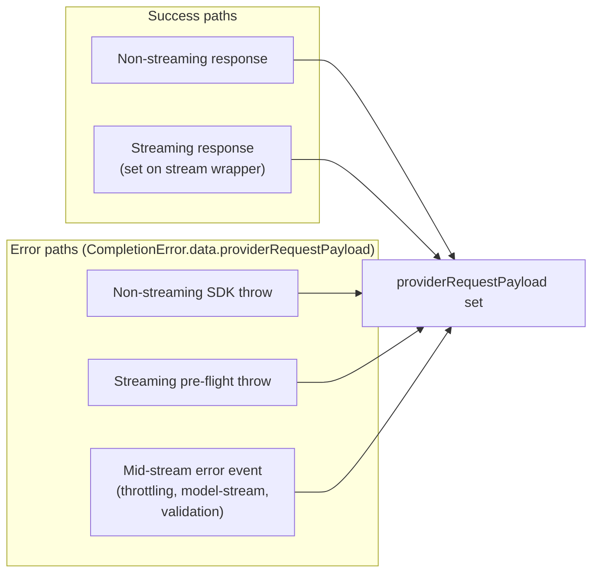
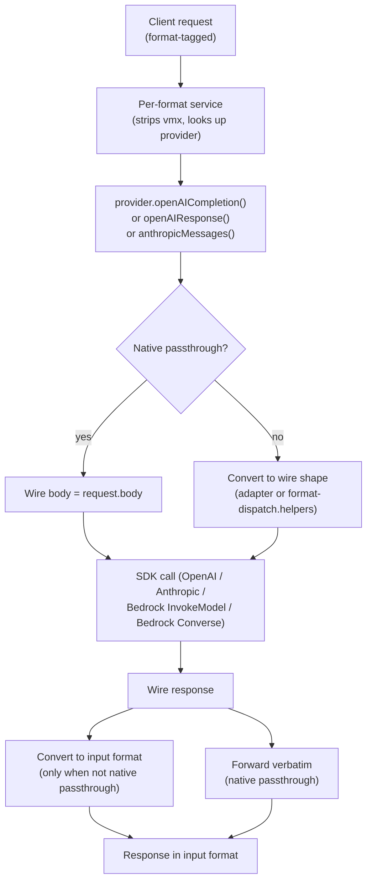

# AI Provider Architecture

How VM-X routes a completion request through to a model provider, and where the
format conversion lives.

## TL;DR

- Three input formats: **OpenAI Chat Completions**, **OpenAI Responses**, and
  **Anthropic Messages**. Each gets its own controller + service.
- Every provider implements a 3-method `CompletionProvider` interface:
  `openAICompletion`, `openAIResponse`, `anthropicMessages`. The output format
  always matches the input format (no format switching mid-pipeline).
- Each provider lives in a per-provider folder with 4 files: one per input
  format plus an `index.ts` composer. New providers follow the same template.
- The audit row stores **both** payloads: `requestPayload` (what the client
  sent) and `providerRequestPayload` (what the upstream SDK saw).

## Three input formats, three controllers, three services

```
packages/api/src/gateway/
  completion.controller.ts          ← POST /chat/completions  → CompletionService
  responses/responses.controller.ts ← POST /responses         → ResponsesService
  anthropic/anthropic.controller.ts ← POST /anthropic/messages → AnthropicMessagesService
  completion.service.ts             ← shared orchestrator (routing, gating, audit)
  responses/responses.service.ts    ← thin per-format adapter
  anthropic/anthropic.service.ts    ← thin per-format adapter
  routing.service.ts                ← cross-format routing rules
  gate.service.ts                   ← cross-format rate/capacity gate
  cost/                             ← cost calculation (OpenAI-Usage shape)
```

Each controller injects exactly one service. The two non-OpenAI services are
thin adapters that delegate to `CompletionService.complete({format, body})` for
now — they exist to give the controller a per-format shape. The full Phase E
goal (each service owns its own pipeline end-to-end) is a follow-up.

## The `CompletionProvider` interface

Every provider class exposes three methods, one per input format. Each method
returns a response in the **same** format. No internal pivot format leaks into
the public contract.

```ts
interface CompletionProvider {
  provider: AIProviderDto;

  openAICompletion(request: ChatCompletionCreateParams, connection: AIConnectionEntity, model: AIResourceModelConfigEntity, options?: CompletionRequestOptions): Promise<OpenAICompletionResponse>;

  openAIResponse(request: ResponseCreateParams, connection: AIConnectionEntity, model: AIResourceModelConfigEntity, options?: CompletionRequestOptions): Promise<OpenAIResponseResponse>;

  anthropicMessages(request: AnthropicMessagesRequest, connection: AIConnectionEntity, model: AIResourceModelConfigEntity, options?: CompletionRequestOptions): Promise<AnthropicMessagesResponse>;
}
```

Each method:

- Receives the client body in that format (with the gateway's `vmx` envelope
  stripped — the service does that before dispatch).
- Decides internally whether to passthrough (provider's wire format matches
  the input) or convert.
- Captures `providerRequestPayload` (the wire body) on every success/error
  path including mid-stream errors.
- Returns the response in the input format.

**Per-provider passthrough/convert matrix:**

| Provider                                                 | `openAICompletion`                       | `openAIResponse`               | `anthropicMessages`              |
| -------------------------------------------------------- | ---------------------------------------- | ------------------------------ | -------------------------------- |
| `OpenAIProvider`                                         | passthrough                              | convert via Chat Completions\* | convert via Chat Completions\*   |
| `GeminiProvider` / `GroqProvider` / `PerplexityProvider` | passthrough (OpenAI-compat)              | convert via Chat Completions   | convert via Chat Completions     |
| `AnthropicProvider`                                      | convert ↔ Anthropic                      | convert via Chat Completions\* | passthrough                      |
| `AWSBedrockInvokeProvider` (Anthropic on the wire)       | convert ↔ Anthropic + Bedrock-wire shape | convert via Chat Completions\* | passthrough (Bedrock-wire shape) |
| `AWSBedrockProvider` (Converse)                          | convert ↔ Converse                       | convert via Chat Completions\* | convert via Chat Completions\*   |

`*` = transitional. The Phase B goal is direct per-pair converters
(Responses↔Anthropic, Anthropic↔Converse, Responses↔Converse,
`client.responses.create` native passthrough on OpenAI). When those land,
`format-dispatch.helpers.ts` and the legacy `responses-converter.ts` /
`anthropic-converter.ts` can be deleted.

## Per-provider folder structure

Every provider lives in its own folder under `packages/api/src/ai-provider/`:

```
ai-provider/
  openai/
    shared.ts                          ← OpenAIConnectionConfig, createOpenAIClient, parseDuration, header helpers
    openai-chat-completion.provider.ts ← OpenAIChatCompletionProvider — owns the SDK call + error mapping
    openai-response.provider.ts        ← OpenAIResponseProvider — converts Responses → Chat Completions, dispatches
    anthropic-messages.provider.ts     ← OpenAIAnthropicMessagesProvider — converts Anthropic → Chat Completions, dispatches
    index.ts                           ← OpenAIProvider composer — implements CompletionProvider by delegating

  gemini/                              ← extends OpenAI's classes; only createClient differs (Gemini's baseURL)
    openai-chat-completion.provider.ts ← GeminiChatCompletionProvider extends OpenAIChatCompletionProvider
    openai-response.provider.ts        ← GeminiResponseProvider extends OpenAIResponseProvider
    anthropic-messages.provider.ts     ← GeminiAnthropicMessagesProvider extends OpenAIAnthropicMessagesProvider
    index.ts                           ← GeminiProvider composer

  groq/        ← same shape, baseURL = api.groq.com/openai/v1
  perplexity/  ← same shape, baseURL = api.perplexity.ai

  anthropic/
    shared.ts                          ← AnthropicConnectionConfig, createAnthropicClient, filterAnthropicHeaders, handleAnthropicError, AnthropicDispatcher (the @Injectable that owns the SDK call), stripGatewayEnvelopes
    openai-chat-completion.provider.ts ← AnthropicOpenAICompletionProvider — converts Chat Completions → Anthropic, dispatches
    openai-response.provider.ts        ← AnthropicOpenAIResponseProvider — Responses → Chat Completions → Anthropic
    anthropic-messages.provider.ts     ← AnthropicMessagesProvider — strips vmx + dispatches verbatim
    index.ts                           ← AnthropicProvider composer

  aws-bedrock-invoke/                  ← Anthropic on the wire + AWS transport
    shared.ts                          ← AWSBedrockInvokeDispatcher (extends AWSBedrockBaseProvider) — owns InvokeModel command, AWS event-stream parser, AWS exception mapping
    shared.spec.ts                     ← Unit tests for the AWS event-stream parser + exception mapping
    openai-chat-completion.provider.ts ← Chat Completions → Anthropic → Bedrock-Invoke wire
    openai-response.provider.ts        ← Responses → Chat Completions → Anthropic → Bedrock-Invoke wire
    anthropic-messages.provider.ts     ← Anthropic → Bedrock-Invoke wire (native passthrough)
    index.ts                           ← AWSBedrockInvokeProvider composer

  aws-bedrock-converse/                ← AWS Converse wire shape (distinct from both OpenAI and Anthropic)
    shared.ts                          ← AWSBedrockConverseDispatcher (extends AWSBedrockBaseProvider) — owns AWS Converse Command + Chat Completions ↔ Converse conversion + streaming + error mapping
    openai-chat-completion.provider.ts ← Delegates to dispatcher.completion()
    openai-response.provider.ts        ← Responses → Chat Completions → Converse
    anthropic-messages.provider.ts     ← Anthropic → Chat Completions → Converse
    index.ts                           ← AWSBedrockProvider composer (DTO + uiComponents)

  providers/
    aws-bedrock-base.provider.ts       ← Abstract base for AWS providers (cached STS-credential createClient)

  adapters/
    anthropic-messages.adapter.ts      ← Canonical OpenAI ↔ Anthropic converter (used by both Anthropic and Bedrock-Invoke)

  format-dispatch.helpers.ts           ← Transitional bridge: takes a ChatCompletion-shape dispatcher and produces openAIResponse / anthropicMessages handlers via the existing converters. Deleted once direct per-pair converters land.
```

**Composer pattern.** Every `index.ts` is a thin `@Injectable` class that
implements the 3-method `CompletionProvider` interface by delegating to the
three sibling format-specific classes. Example for OpenAI:

```ts
@Injectable()
export class OpenAIProvider implements CompletionProvider {
  provider: AIProviderDto;

  constructor(private readonly chatCompletionProvider: OpenAIChatCompletionProvider, private readonly responseProvider: OpenAIResponseProvider, private readonly anthropicMessagesProvider: OpenAIAnthropicMessagesProvider) {
    this.provider = {
      /* DTO */
    };
  }

  openAICompletion(req, conn, model, options) {
    return this.chatCompletionProvider.handle(req, conn, model, options);
  }
  openAIResponse(req, conn, model, options) {
    return this.responseProvider.handle(req, conn, model, options);
  }
  anthropicMessages(req, conn, model, options) {
    return this.anthropicMessagesProvider.handle(req, conn, model, options);
  }
}
```

**Subclassing for OpenAI-compat providers.** Gemini/Groq/Perplexity extend
OpenAI's format-specific classes via NestJS DI:

```ts
@Injectable()
export class GeminiChatCompletionProvider extends OpenAIChatCompletionProvider {
  protected override createClient(connection) {
    return createOpenAIClient(connection, 'https://generativelanguage.googleapis.com/v1beta/openai');
  }
}

@Injectable()
export class GeminiResponseProvider extends OpenAIResponseProvider {
  constructor(geminiChat: GeminiChatCompletionProvider) {
    super(geminiChat); // The parent injects whichever ChatCompletion class is passed.
  }
}
```

**Shared dispatcher.** Anthropic / Bedrock-Invoke / Bedrock-Converse all have a
`shared.ts` containing an `@Injectable` dispatcher class that owns the SDK call.
The three format-specific files inject the dispatcher and call its `dispatch()`
method (or in Converse's case, `completion()`).

## Audit observability invariant

Every completion call writes one audit row with these JSONB columns:

| Column                   | Source                                                                                                                       |
| ------------------------ | ---------------------------------------------------------------------------------------------------------------------------- |
| `requestPayload`         | Body the **client** sent — preserved through any conversion the gateway does.                                                |
| `providerRequestPayload` | Body the **upstream SDK** saw on the wire — captured pre-flight by the provider.                                             |
| `responseData`           | Response (or chunk array for streaming) — currently OpenAI ChatCompletion shape (Phase C will widen this to the wire shape). |
| `responseHeaders`        | Filtered to `x-*` headers only.                                                                                              |
| `cost`                   | Per-request cost breakdown (input, output, cached, reasoning, total).                                                        |
| `events`                 | Routing / fallback events fired during dispatch.                                                                             |

The `providerRequestPayload` invariant holds on every code path:



Mid-stream errors are caught by per-provider stream wrappers that re-throw a
`CompletionError` with the wire body attached. The Anthropic dispatcher's
`iterateSdkStream` and the Bedrock-Invoke dispatcher's `parseBedrockEventStream`
both follow this pattern. Bedrock-Converse's `convertStream` similarly captures
the wire body via the `requestBody` parameter threaded into the generator.

## Where conversion lives

Every conversion is co-located with its provider's format-specific file. There
is no central `adapters/` shelf for everything — only `adapters/anthropic-messages.adapter.ts`
exists today (the canonical OpenAI ↔ Anthropic converter, used by both
Anthropic and Bedrock-Invoke).



---

# Adding a new AI provider

Practical "I want to add provider X" walkthrough. Pick the right starting
point based on what wire shape the upstream speaks, then follow the per-step
recipe.

## Decision tree

```
What does provider X speak on the wire?

1. OpenAI Chat Completions–compatible endpoint (Gemini, Groq, Perplexity, etc.)
   → Template A — extend OpenAI's classes, override createClient

2. Anthropic Messages on the wire (most "Claude on Y" services)
   → Template B — model after AnthropicProvider or AWSBedrockInvokeProvider

3. Custom wire shape (Vertex AI native, Bedrock Converse, proprietary RPC)
   → Template C — model after AWSBedrockProvider (Converse) — write all 3 conversions
```

## Template A: OpenAI-compat upstream (Gemini/Groq/Perplexity pattern)

**Effort:** ~5 small files, ~150 LOC total.

Create the folder `packages/api/src/ai-provider/<provider-id>/` with these
files:

### `<provider-id>/openai-chat-completion.provider.ts`

```ts
import { Injectable } from '@nestjs/common';
import OpenAI from 'openai';
import { AIConnectionEntity } from '../../ai-connection/entities/ai-connection.entity';
import { OpenAIChatCompletionProvider } from '../openai/openai-chat-completion.provider';
import { type OpenAIConnectionConfig, createOpenAIClient } from '../openai/shared';

const FOOBAR_BASE_URL = 'https://api.foobar.example.com/v1';

@Injectable()
export class FooBarChatCompletionProvider extends OpenAIChatCompletionProvider {
  protected override createClient(connection: AIConnectionEntity<OpenAIConnectionConfig>): Promise<OpenAI> {
    return createOpenAIClient(connection, FOOBAR_BASE_URL);
  }
}
```

### `<provider-id>/openai-response.provider.ts`

```ts
import { Injectable } from '@nestjs/common';
import { OpenAIResponseProvider } from '../openai/openai-response.provider';
import { FooBarChatCompletionProvider } from './openai-chat-completion.provider';

@Injectable()
export class FooBarResponseProvider extends OpenAIResponseProvider {
  constructor(foobarChat: FooBarChatCompletionProvider) {
    super(foobarChat);
  }
}
```

### `<provider-id>/anthropic-messages.provider.ts`

```ts
import { Injectable } from '@nestjs/common';
import { OpenAIAnthropicMessagesProvider } from '../openai/anthropic-messages.provider';
import { FooBarChatCompletionProvider } from './openai-chat-completion.provider';

@Injectable()
export class FooBarAnthropicMessagesProvider extends OpenAIAnthropicMessagesProvider {
  constructor(foobarChat: FooBarChatCompletionProvider) {
    super(foobarChat);
  }
}
```

### `<provider-id>/index.ts`

```ts
import { Injectable } from '@nestjs/common';
import { CompletionProvider /* response types */ } from '../ai-provider.types';
import { AIProviderDto } from '../dto/ai-provider.dto';
import { FooBarChatCompletionProvider } from './openai-chat-completion.provider';
import { FooBarResponseProvider } from './openai-response.provider';
import { FooBarAnthropicMessagesProvider } from './anthropic-messages.provider';

export type FooBarConnectionConfig = { apiKey: string };

@Injectable()
export class FooBarProvider implements CompletionProvider {
  provider: AIProviderDto;

  constructor(private readonly chatCompletionProvider: FooBarChatCompletionProvider, private readonly responseProvider: FooBarResponseProvider, private readonly anthropicMessagesProvider: FooBarAnthropicMessagesProvider) {
    this.provider = {
      id: 'foobar',
      name: 'FooBar',
      description: 'FooBar AI Provider',
      defaultModel: 'foobar-medium',
      config: {
        logo: { url: '/assets/logos/foobar.png' },
        connection: {
          form: {
            type: 'object',
            title: 'FooBar Properties',
            required: ['apiKey'],
            properties: {
              apiKey: {
                type: 'string',
                format: 'secret',
                title: 'FooBar API Key',
                placeholder: 'e.g. fb_…',
                description: 'Get a key at [FooBar Console](https://foobar.example.com/keys).',
              },
            },
            errorMessage: { required: { apiKey: 'API Key is required' } },
          },
        },
      },
    };
  }

  openAICompletion(req, conn, model, options) {
    return this.chatCompletionProvider.handle(req, conn, model, options);
  }
  openAIResponse(req, conn, model, options) {
    return this.responseProvider.handle(req, conn, model, options);
  }
  anthropicMessages(req, conn, model, options) {
    return this.anthropicMessagesProvider.handle(req, conn, model, options);
  }
}
```

### Wire into DI

In `packages/api/src/ai-provider/ai-provider.module.ts`:

```ts
import { FooBarProvider } from './foobar';
import { FooBarChatCompletionProvider } from './foobar/openai-chat-completion.provider';
import { FooBarResponseProvider } from './foobar/openai-response.provider';
import { FooBarAnthropicMessagesProvider } from './foobar/anthropic-messages.provider';

@Module({
  providers: [
    /* existing providers */
    FooBarProvider,
    FooBarChatCompletionProvider,
    FooBarResponseProvider,
    FooBarAnthropicMessagesProvider,
    AIProviderService,
  ],
})
```

In `packages/api/src/ai-provider/ai-provider.service.ts`, register the
provider in the constructor:

```ts
constructor(
  /* existing constructor params */
  private readonly fooBarProvider: FooBarProvider,
) {
  /* existing registrations */
  this.providers[fooBarProvider.provider.id] = this.fooBarProvider;
}
```

### Test factory

In `packages/api/src/__integration__/helpers/factories.ts`:

```ts
export const buildFooBarProvider = () => {
  const logger = makeStubLogger();
  const chat = new FooBarChatCompletionProvider(logger);
  return new FooBarProvider(chat, new FooBarResponseProvider(chat), new FooBarAnthropicMessagesProvider(chat));
};
```

### Logo asset

Add `packages/api/assets/logos/<provider-id>.png` (square, ≤ 200KB).

That's it. The `__integration__/live-flow/` matrix and the
`__integration__/providers/<provider-id>.spec.ts` files pick the new provider
up via the `live-flow.ts` registration table.

## Template B: Anthropic-on-the-wire upstream

**Effort:** ~7 files, similar shape to `aws-bedrock-invoke/`. Use that folder
as the canonical reference. The key files:

- `<provider-id>/shared.ts` — the SDK client, the dispatcher class with the
  SDK call + error mapping. Extends the abstract base if there is one (the
  AWS providers extend `AWSBedrockBaseProvider`).
- `<provider-id>/openai-chat-completion.provider.ts` — converts OpenAI body
  using `openAIRequestToAnthropic` from
  `adapters/anthropic-messages.adapter.ts`, then dispatches.
- `<provider-id>/openai-response.provider.ts` — Responses → Chat Completions
  via `format-dispatch.helpers.ts` for now. Direct Responses↔Anthropic adapter
  is a Phase B follow-up.
- `<provider-id>/anthropic-messages.provider.ts` — passthrough; just strips
  the gateway's `vmx` envelope and dispatches.
- `<provider-id>/index.ts` — composer with the DTO.

The shared dispatcher returns `CompletionResponse` (ChatCompletion shape) so
the gateway's audit/streaming/cost pipeline keeps working unchanged. Native
Anthropic-shape output is the Phase C follow-up.

**Two pitfalls every Anthropic-on-the-wire provider hits:**

1. **Strip the `vmx` field before the wire call.** Anthropic's API rejects
   unknown top-level fields with `400: vmx — Extra inputs are not permitted`.
   The shared `stripGatewayEnvelopes` helper in `anthropic/shared.ts` is the
   reference.
2. **Capture `providerRequestPayload`.** Set it on every success and error
   path — see the `iterateSdkStream` / `parseBedrockEventStream` pattern in
   the Anthropic and Bedrock-Invoke shared files.

## Template C: Custom wire shape (Bedrock Converse pattern)

**Effort:** the largest. `aws-bedrock-converse/shared.ts` is ~1100 LOC of
OpenAI ↔ Converse conversion. Use that folder as the canonical reference.

What you'll write:

- `<provider-id>/shared.ts` — the dispatcher with all conversion logic +
  SDK call + error mapping.
- `<provider-id>/openai-chat-completion.provider.ts` — thin wrapper that
  delegates to `dispatcher.completion()`.
- `<provider-id>/openai-response.provider.ts` — uses the Responses → Chat
  Completions helper, then delegates.
- `<provider-id>/anthropic-messages.provider.ts` — uses the Anthropic → Chat
  Completions helper, then delegates.
- `<provider-id>/index.ts` — composer with the rich DTO.

Direct per-pair converters (Anthropic ↔ Converse, Responses ↔ Converse) are
the Phase B follow-up. The structural split means landing them edits only the
matching format-specific file + (optionally) `shared.ts` for new helpers.

## Provider-specific args & per-model tuning

Every provider gets these for free — they're handled by the per-format service
**before** dispatch:

- **`vmx.providerArgs`** — caller-supplied object that's spread on top of the
  parsed body (after `defaultArgs`). Lets users inject native fields the
  gateway shape doesn't model (`search_recency_filter` for Perplexity, `top_k`
  for Anthropic, `safetySettings` for Gemini).
- **Per-model `maxRetries`** — set on the resource's `AIResourceModelConfigEntity`.
  Threaded into `CompletionRequestOptions.maxRetries`. The OpenAI Chat
  Completion provider (and its subclasses) forward it to the SDK; other
  dispatchers should honour it explicitly.
- **Per-model `timeoutMs`** — composed with `vmx.timeoutMs` into a shared
  `AbortSignal`. Providers must forward `options.signal` to their SDK call so
  cancellation actually frees up upstream tokens.

## Connection form schema

The `provider.config.connection.form` field is a JSON Schema fragment the UI
renders verbatim via `react-jsonschema-form`. Common patterns:

| Field type            | JSON Schema                                                             | UI widget               |
| --------------------- | ----------------------------------------------------------------------- | ----------------------- |
| API key               | `{ type: 'string', format: 'secret', title, placeholder, description }` | Password input + reveal |
| URL                   | `{ type: 'string', format: 'uri', title, placeholder }`                 | Plain text input        |
| Enum                  | `{ type: 'string', enum: ['a','b','c'], title }`                        | Dropdown                |
| Optional bool         | `{ type: 'boolean', title, default: false }`                            | Switch                  |
| AWS-style multi-field | nested `properties`, `oneOf` for "static keys vs. role-based" branches  | Conditional sub-form    |

`description` accepts Markdown and is rendered as helper text — use it to link
to the provider's API-key creation page. `errorMessage.required` lets you
customise the per-field "required" message.

If a provider needs more complex auth (OAuth, AWS role assumption, …), see
[`aws-bedrock-converse/index.ts`](../packages/api/src/ai-provider/aws-bedrock-converse/index.ts)
for a worked example with `oneOf` discriminator + extra
`connection.uiComponents` (link buttons, accordion explanations).

## Common gotchas

- **Stripping `vmx` / `__vmx_passthrough`**. Strict OpenAI-compat upstreams
  (Groq, Anthropic native) reject unknown top-level fields with a 400. The
  base `OpenAIChatCompletionProvider` calls `stripPassthroughEnvelope()` for
  you; non-OpenAI dispatchers must strip both manually before sending. See
  [`passthrough.helpers.ts`](../packages/api/src/ai-provider/passthrough.helpers.ts).
- **Tool-schema field omission**. Some upstreams reject `null` on optional
  fields (Groq rejects `tools[].function.strict: null`). Always _omit_ fields
  when unset, don't pass `null`.
- **Image fetches need SSRF guards**. If your provider's request format
  carries `image_url` / `document.source.url` and you fetch them server-side,
  call `assertSafeOutboundUrl()` first
  ([`url-safety.ts`](../packages/api/src/ai-provider/url-safety.ts)) — blocks
  RFC1918, AWS IMDS, loopback, and IPv6 link-local hosts.
- **Usage capture for streaming**. The gateway only counts the **first**
  chunk that carries `usage`. Make sure your stream-converter forwards the
  upstream's final usage event onto a chunk; otherwise audit cost rows record
  `null` for that request.
- **`audit.cron flush` errors that look like ORM problems**. If you add a new
  audit-row column and the migration uses snake_case with underscores around
  digits (`cache_creation_ephemeral_5m_tokens`), Kysely's CamelCasePlugin will
  look for a different mapped name (`cache_creation_ephemeral5m_tokens`) and
  every flush silently fails. Match the migration to the entity field — see
  [`migrations/10-request-audit-table.ts`](../packages/api/src/migrations/10-request-audit-table.ts).

## Reference: where to look

- 3-method `CompletionProvider` interface → `packages/api/src/ai-provider/ai-provider.types.ts`
- Per-provider folders → `packages/api/src/ai-provider/{openai,gemini,groq,perplexity,anthropic,aws-bedrock-invoke,aws-bedrock-converse}/`
- DI module → `packages/api/src/ai-provider/ai-provider.module.ts`
- Per-format gateway services → `packages/api/src/gateway/{completion.service,responses/responses.service,anthropic/anthropic.service}.ts`
- Three controllers → `packages/api/src/gateway/{completion.controller,responses/responses.controller,anthropic/anthropic.controller}.ts`
- Canonical OpenAI ↔ Anthropic adapter → `packages/api/src/ai-provider/adapters/anthropic-messages.adapter.ts`
- Format-dispatch helpers (transitional) → `packages/api/src/ai-provider/format-dispatch.helpers.ts`
- Live-flow tests → `packages/api/src/__integration__/live-flow/{completion,responses,anthropic-messages}.spec.ts`
- Per-provider live tests → `packages/api/src/__integration__/providers/<provider-id>.spec.ts`

## Open follow-ups

- **Direct per-pair converters** — Responses↔Anthropic, Anthropic↔Converse,
  Responses↔Converse, OpenAI Responses native passthrough
  (`client.responses.create`). Once these land, `format-dispatch.helpers.ts`
  and the legacy `responses-converter.ts` / `anthropic-converter.ts` can be
  deleted.
- **Streaming envelope wired through `CompletionService.createDataStream`** —
  the gateway's streaming wrapper still types streams as
  `AsyncIterable<ChatCompletionChunk>`. Phase C teaches it three native chunk
  shapes (OpenAI Chat Completion / OpenAI Responses event / Anthropic SSE
  event) and adds per-format `extractUsage` helpers.
- **Independent per-format services** — each of the three gateway services
  currently delegates to `CompletionService.complete()`. The full Phase E
  goal is for each service to own its own routing/gating/audit pipeline with
  cross-format helpers (`RoutingService` etc.) injected, not delegated.
- **Routing / gate generalisation** — `RoutingService.evaluate` and
  `GateService.shouldAllow` still assume OpenAI-shape body; the planned
  `RoutingContext` carries the input format + per-format token counters.
