# Architecture

VM-X AI is built on a modern, scalable stack designed for production use. This page provides an overview of the technical architecture and components.

## Technology Stack

### Backend (API Server)

- **Framework**: [NestJS](https://nestjs.com/) - Progressive Node.js framework
- **Runtime**: Node.js 24+
- **Language**: TypeScript
- **HTTP Server**: Fastify (high-performance HTTP framework)
- **Database ORM**: Kysely (type-safe SQL query builder)

### Frontend (UI Application)

- **Framework**: [Next.js](https://nextjs.org/) - React framework with server-side rendering
- **UI Library**: Material-UI (MUI) - React component library
- **State Management**: Zustand
- **API Client**: Auto-generated from OpenAPI specification

### Data Storage

#### Primary Database: PostgreSQL

- **Purpose**: Configuration data, audit logs, user management
- **Schema**: Managed through Kysely migrations
- **Connection Pooling**: Separate read/write pools for scalability
- **Features**:
  - Workspaces and environments for multi-tenancy
  - AI Connections and AI Resources configuration
  - API Keys and user management
  - Completion audit logs

#### Time-Series Database

**QuestDB** (default) or **AWS Timestream**

- **Purpose**: High-performance storage of usage metrics
- **Data**: Token usage, request counts, latency metrics
- **Query Performance**: Optimized for time-series queries
- **Integration**: Automatic export from completion service

### Caching and Capacity Tracking

**Redis** (Single or Cluster mode)

- **Purpose**: 
  - Capacity tracking (RPM, TPM counters)
  - Caching of AI connections and resources
  - Prioritization metrics storage
  - Session management
- **Modes**:
  - Single node: For development and small deployments
  - Cluster: For production high availability

### Encryption

**AWS KMS** (production) or **Libsodium** (development)

- **Purpose**: Encrypt sensitive credentials (API keys, tokens)
- **Storage**: Encrypted credentials stored in PostgreSQL
- **Access**: Decryption happens in-memory only

### Observability

**OpenTelemetry** Integration

- **Traces**: Distributed tracing across services
- **Metrics**: Custom metrics for completion requests, routing, capacity
- **Export**: Compatible with any OpenTelemetry backend (Datadog, Jaeger, Prometheus, etc.)

## System Architecture

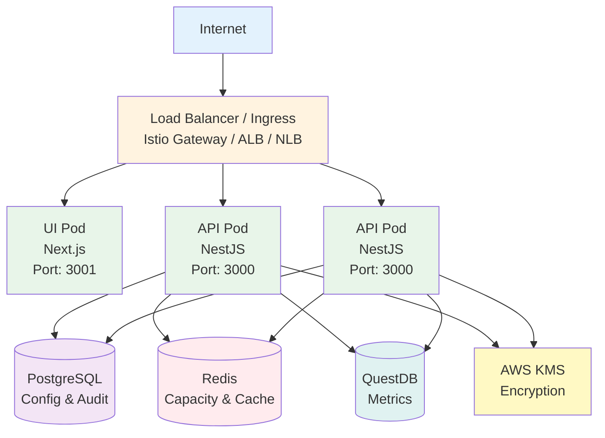

## Request Flow

### 1. Client Request

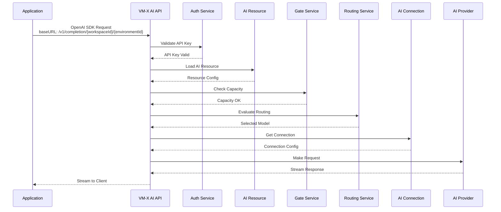

The application uses the standard OpenAI SDK to make requests:

```typescript
import OpenAI from 'openai';

const workspaceId = "6c41dc1b-910c-4358-beef-2c609d38db31";
const environmentId = "6c1957ca-77ca-49b3-8fa1-0590281b8b44";

const openai = new OpenAI({
  apiKey: 'vmx-api-key-here',
  baseURL: `https://vm-x-ai.example.com/v1/completion/${workspaceId}/${environmentId}`,
});

const completion = await openai.chat.completions.create({
  model: 'chat-completion', // Resource name, not actual model
  messages: [{ role: 'user', content: 'Hello!' }],
});
```

### 2. Authentication & Authorization

VM-X AI supports multiple authentication methods:

#### API Key Authentication

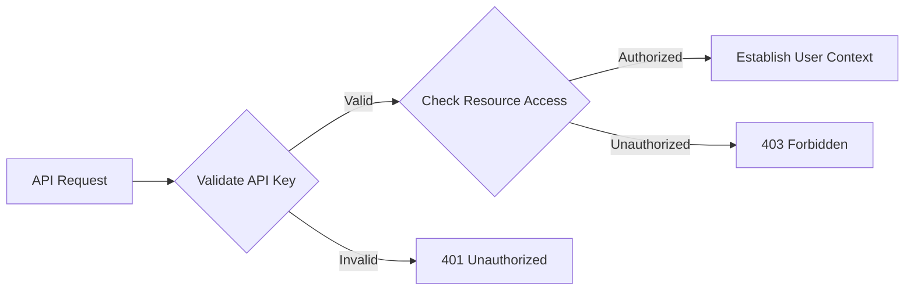

- API key is validated
- Resource access is checked
- User context is established (if applicable)

#### OIDC Federated Login (SSO)

For UI access, VM-X AI supports OIDC federated login:

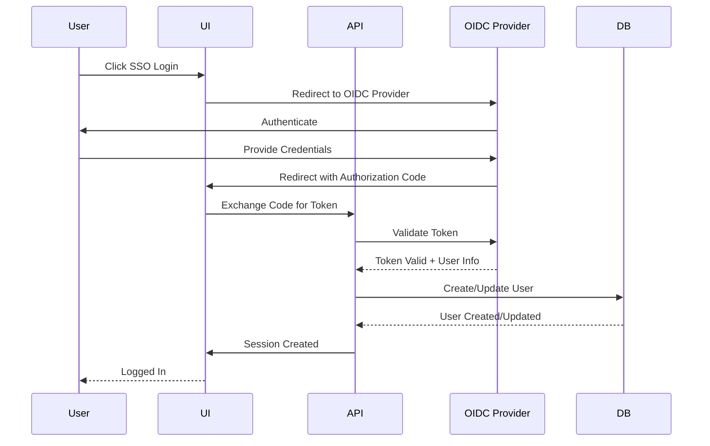

**OIDC Configuration:**

Configure via environment variables:
- `OIDC_FEDERATED_ISSUER`: OIDC issuer URL (required)
- `OIDC_FEDERATED_CLIENT_ID`: OIDC client ID (required)
- `OIDC_FEDERATED_CLIENT_SECRET`: OIDC client secret (optional)
- `OIDC_FEDERATED_SCOPE`: OIDC scopes (default: `openid profile email`)
- `OIDC_FEDERATED_DEFAULT_ROLE`: Default role for federated users (default: `power-user`)

When OIDC is configured, the login page displays an "SSO Login" button. After successful authentication, users are automatically created (if they don't exist) and assigned the default role.

### 3. Resource Resolution

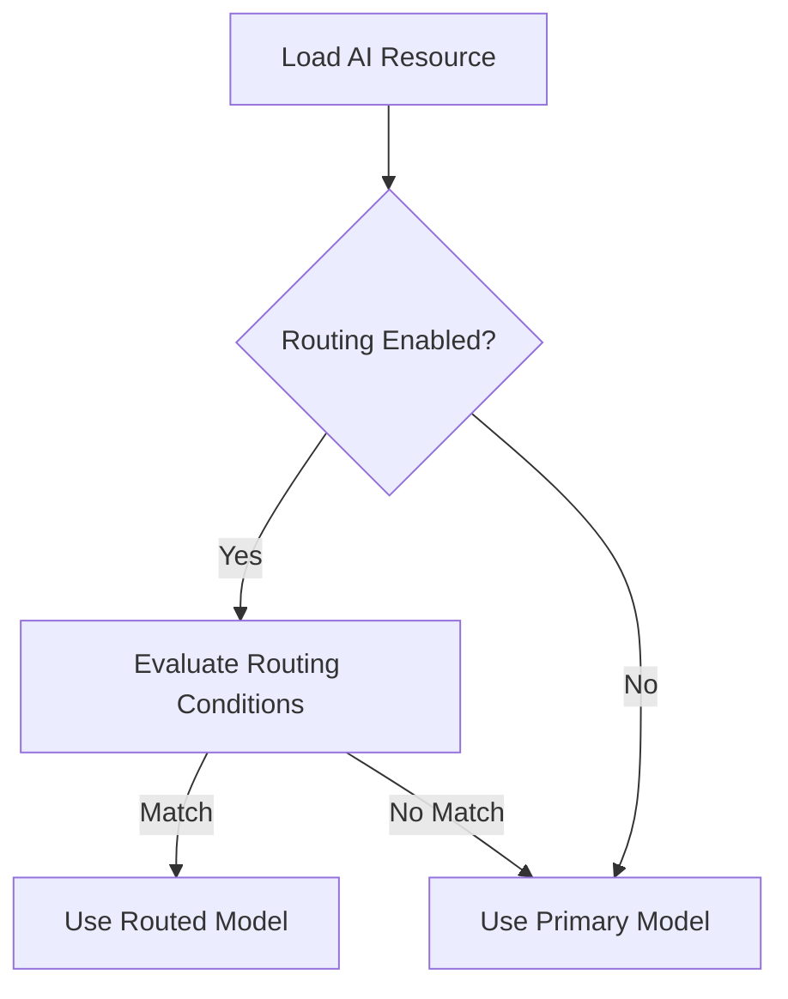

- AI Resource is loaded from cache or database
- Routing conditions are evaluated
- Primary or routed model is selected

### 4. Capacity Check

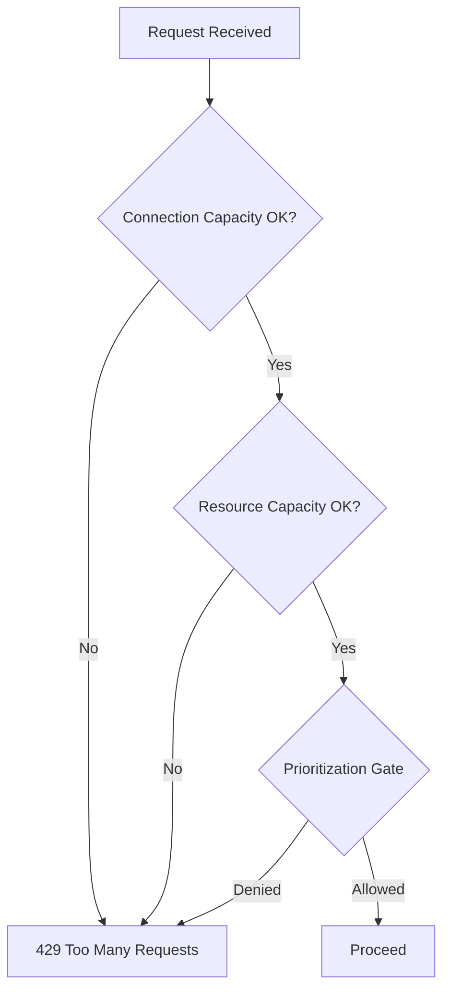

- Connection-level capacity is checked (RPM, TPM)
- Resource-level capacity is checked
- Prioritization gate evaluates if request should proceed

### 5. Provider Request

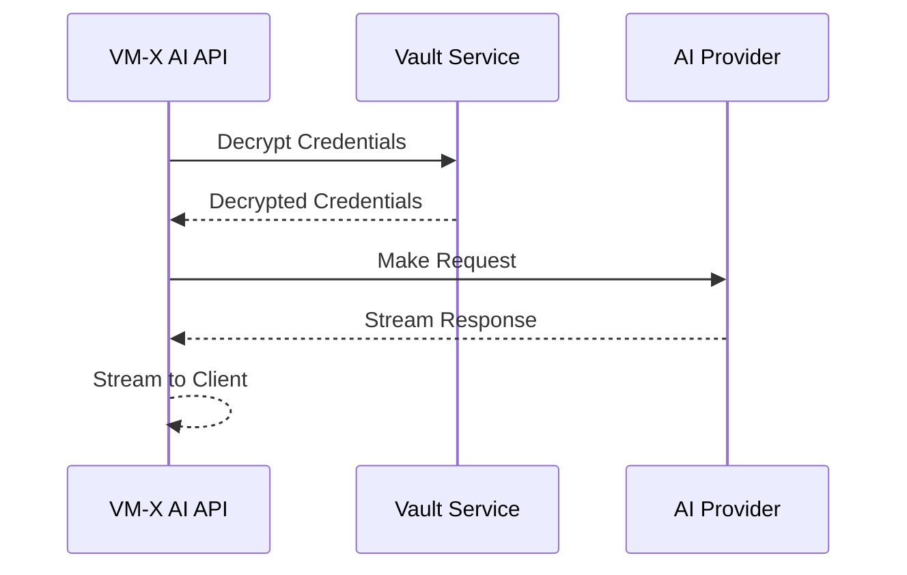

- Credentials are decrypted (AWS KMS or Libsodium)
- Request is made to the selected AI provider
- Response is streamed back to the client

### 6. Fallback (if needed)

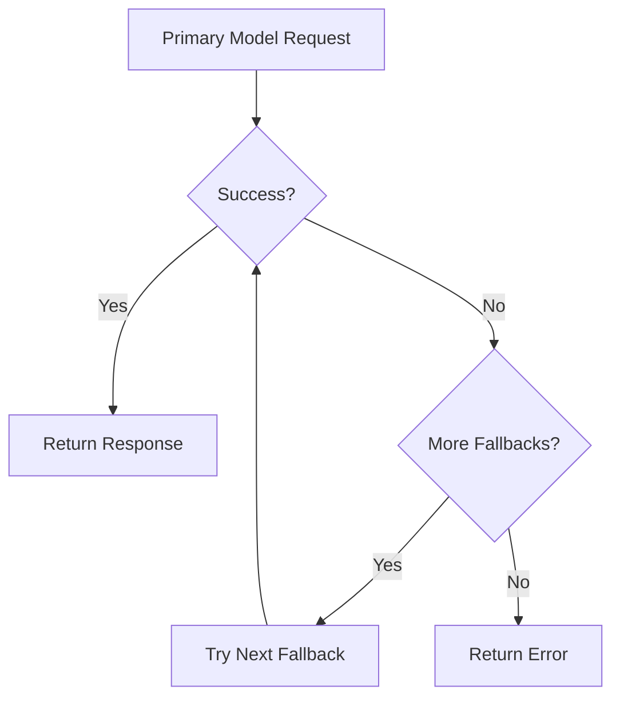

- If primary model fails, fallback models are tried in order
- First successful response is returned
- All attempts are logged for analysis

### 7. Metrics & Audit

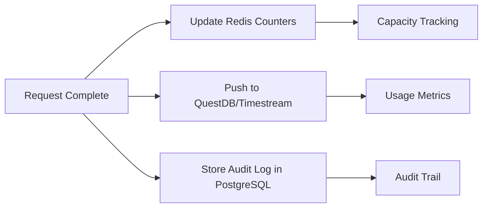

- Capacity counters are updated in Redis
- Usage metrics are pushed to time-series database
- Audit log entry is created in PostgreSQL

## Component Details

### API Server (NestJS)

**Key Modules:**

- **Completion Module**: Handles chat completion requests
- **AI Connection Module**: Manages provider connections
- **AI Resource Module**: Manages logical resources
- **API Key Module**: Manages API keys and access control
- **Capacity Module**: Tracks and enforces capacity limits
- **Prioritization Module**: Implements prioritization algorithms
- **Audit Module**: Stores completion audit logs
- **Usage Module**: Stores time-series usage metrics
- **Vault Module**: Handles credential encryption/decryption

**Key Services:**

- `CompletionService`: Main request handler
- `ResourceRoutingService`: Evaluates routing conditions
- `GateService`: Capacity and prioritization checks
- `AIConnectionService`: Connection management
- `AIResourceService`: Resource management
- `CompletionAuditService`: Audit logging
- `CompletionUsageService`: Usage metrics

### UI Application (Next.js)

**Key Features:**

- **Workspace Management**: Multi-workspace support
- **Environment Management**: Isolated environments per workspace
- **AI Connection Management**: Create and configure connections
- **AI Resource Management**: Create and configure resources
- **API Key Management**: Generate and manage API keys
- **Audit Log Viewer**: Browse and filter completion logs
- **Usage Dashboard**: View usage metrics and charts
- **Prioritization Configuration**: Configure pool definitions

### Data Flow

#### Configuration Data

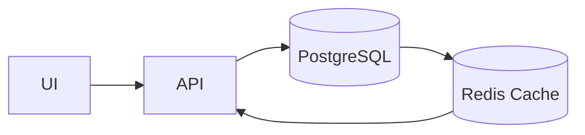

Configuration changes flow from UI to API, are stored in PostgreSQL, and cached in Redis for fast access.

#### Usage Metrics

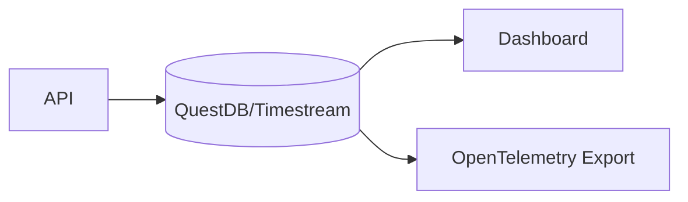

Usage metrics are written to time-series database and can be queried for dashboards or exported to OpenTelemetry.

#### Audit Logs

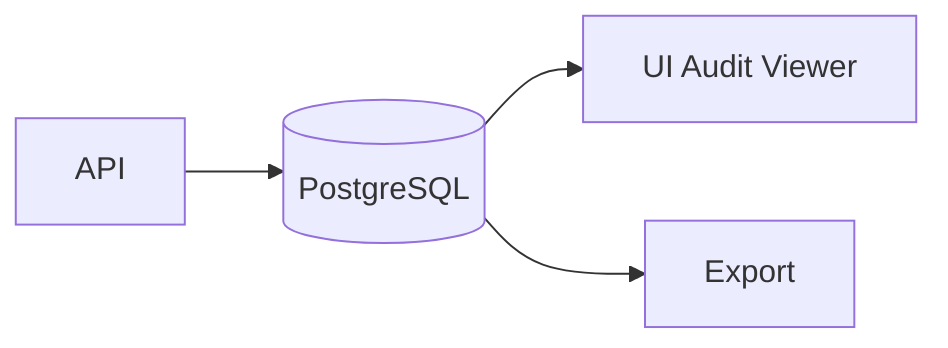

Audit logs are stored in PostgreSQL and can be viewed in the UI or exported.

## Scalability

### Horizontal Scaling

- **API Pods**: Stateless, can scale horizontally
- **UI Pods**: Stateless, can scale horizontally
- **Redis**: Cluster mode for high availability
- **PostgreSQL**: Read replicas for read scaling

### Caching Strategy

- **AI Connections**: Cached in Redis with TTL
- **AI Resources**: Cached in Redis with TTL
- **Capacity Counters**: Stored in Redis with expiration
- **Database Queries**: Connection pooling for efficiency

### Performance Optimizations

- **Connection Pooling**: Separate read/write pools
- **Batch Operations**: Audit logs and metrics are batched
- **Async Processing**: Non-blocking operations where possible
- **Streaming Responses**: Support for streaming completions

## Security

### Encryption

- **At Rest**: Credentials encrypted in PostgreSQL
- **In Transit**: TLS/HTTPS for all communications
- **In Memory**: Credentials decrypted only when needed

### Access Control

- **API Keys**: Resource-level access control
- **Workspaces**: Multi-tenant isolation
- **Environments**: Additional isolation layer

### Audit

- **Complete Audit Trail**: Every request is logged
- **Immutable Logs**: Audit logs cannot be modified
- **Compliance Ready**: Structured for compliance requirements

## Observability

### Metrics

- **Request Count**: Total requests per resource/connection
- **Token Usage**: Prompt, completion, and total tokens
- **Latency**: Request duration, time to first token
- **Error Rates**: Error counts and rates
- **Capacity Usage**: RPM and TPM utilization

### Traces

- **Distributed Tracing**: Full request lifecycle
- **Provider Calls**: Trace individual provider requests
- **Routing Decisions**: Trace routing condition evaluation
- **Capacity Checks**: Trace capacity and prioritization gates

### Logs

- **Structured Logging**: JSON logs with context
- **Request Logs**: All completion requests
- **Error Logs**: Detailed error information
- **Audit Logs**: Complete audit trail

## Deployment Options

VM-X AI can be deployed in various environments:

- **Local Development**: Docker Compose
- **Kubernetes**: Helm chart for any Kubernetes cluster
- **AWS EKS**: Complete CDK stack with EKS
- **AWS ECS**: Complete CDK stack with ECS Fargate

See the [Deployment Guides](../deployment/minikube) for detailed instructions.

