# Architecture

VM-X AI is built on a modern, scalable stack designed for production use. This page provides an overview of the technical architecture and components.

## Technology Stack

### Backend (API Server)

- **Framework**: [NestJS](https://nestjs.com/) - Progressive Node.js framework
- **Runtime**: Node.js 24+
- **Language**: TypeScript
- **HTTP Server**: Fastify (high-performance HTTP framework)
- **Database ORM**: Kysely (type-safe SQL query builder)

### Frontend (UI Application)

- **Framework**: [Next.js](https://nextjs.org/) - React framework with server-side rendering
- **UI Library**: Material-UI (MUI) - React component library
- **State Management**: Zustand
- **API Client**: Auto-generated from OpenAPI specification

### Data Storage

#### Primary Database: PostgreSQL

- **Purpose**: Configuration data, request audit logs, usage analytics, user management
- **Schema**: Managed through Kysely migrations
- **Connection Pooling**: Separate read/write pools for scalability
- **Features**:
  - Workspaces and environments for multi-tenancy
  - AI Connections and AI Resources configuration
  - API Keys, users, roles, and policies
  - `request_audit` table — single source of truth for every completion (token counts, latency, cost, dimensions); the usage API aggregates this table on demand to power dashboards

#### Usage Analytics Storage

There is no separate time-series store. The Usage module reads directly from the Postgres `request_audit` table and applies SQL aggregations (`date_trunc` per granularity, `percentile_cont` for latency percentiles, JSONB extracts for cost/metadata dimensions). This keeps the system to a single source of truth and avoids dual-writes.

### Caching and Capacity Tracking

**Redis** (Single or Cluster mode)

- **Purpose**:
  - Capacity tracking (RPM, TPM counters)
  - Caching of AI connections and resources
  - Prioritization metrics storage
  - Session management
- **Modes**:
  - Single node: For development and small deployments
  - Cluster: For production high availability

### Encryption

**AWS KMS** (production) or **Libsodium** (development)

- **Purpose**: Encrypt sensitive credentials (API keys, tokens)
- **Storage**: Encrypted credentials stored in PostgreSQL
- **Access**: Decryption happens in-memory only

### Observability

**OpenTelemetry** integration provides **application-level** observability and is fully decoupled from the usage analytics data path (which lives in Postgres `request_audit`).

- **Traces**: Distributed tracing across services
- **Metrics**: Application metrics for completion requests, routing, capacity gates
- **Logs**: Structured JSON logs
- **Export**: OTLP to any OpenTelemetry backend. The bundled docker-compose ships an OTel Collector → Jaeger (traces) + Prometheus (metrics) + Loki (logs) + Grafana (dashboards) stack; you can swap in Datadog, New Relic, or any OTLP-compatible vendor.

## System Architecture

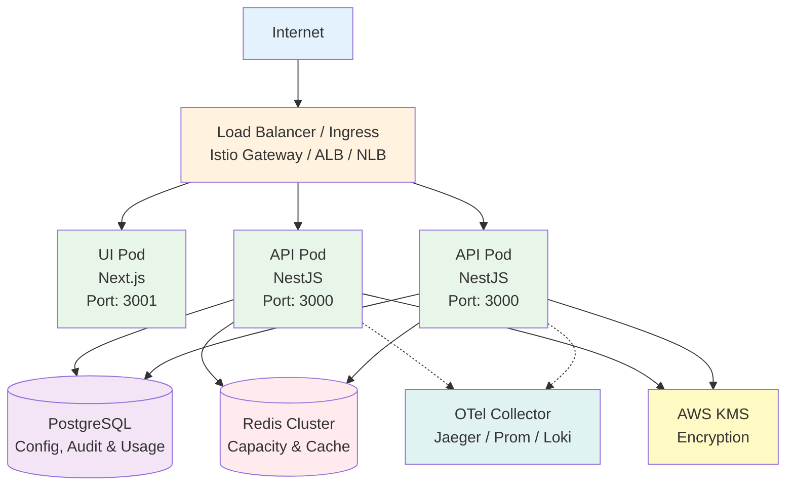
```mermaid
graph TB
    Internet[Internet]
    LB[Load Balancer / Ingress<br/>Istio Gateway / ALB / NLB]

    UI1[UI Pod<br/>Next.js<br/>Port: 3001]
    API1[API Pod<br/>NestJS<br/>Port: 3000]
    API2[API Pod<br/>NestJS<br/>Port: 3000]

    PG[(PostgreSQL<br/>Config, Audit & Usage)]
    Redis[(Redis Cluster<br/>Capacity & Cache)]
    OTel[OTel Collector<br/>Jaeger / Prom / Loki]
    KMS[AWS KMS<br/>Encryption]

    Internet --> LB
    LB --> UI1
    LB --> API1
    LB --> API2

    API1 --> PG
    API2 --> PG
    API1 --> Redis
    API2 --> Redis
    API1 -.-> OTel
    API2 -.-> OTel
    API1 --> KMS
    API2 --> KMS

    style Internet fill:#e3f2fd
    style LB fill:#fff3e0
    style UI1 fill:#e8f5e9
    style API1 fill:#e8f5e9
    style API2 fill:#e8f5e9
    style PG fill:#f3e5f5
    style Redis fill:#ffebee
    style OTel fill:#e0f2f1
    style KMS fill:#fff9c4
```

## Request Flow

### 1. Client Request

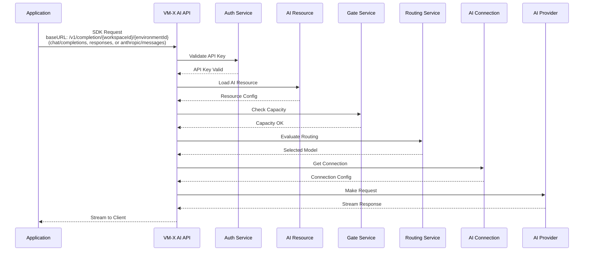
```mermaid
sequenceDiagram
    participant App as Application
    participant VMX as VM-X AI API
    participant Auth as Auth Service
    participant Resource as AI Resource
    participant Gate as Gate Service
    participant Routing as Routing Service
    participant Connection as AI Connection
    participant Provider as AI Provider

    App->>VMX: SDK Request<br/>baseURL: /v1/completion/{workspaceId}/{environmentId}<br/>(chat/completions, responses, or anthropic/messages)
    VMX->>Auth: Validate API Key
    Auth-->>VMX: API Key Valid
    VMX->>Resource: Load AI Resource
    Resource-->>VMX: Resource Config
    VMX->>Gate: Check Capacity
    Gate-->>VMX: Capacity OK
    VMX->>Routing: Evaluate Routing
    Routing-->>VMX: Selected Model
    VMX->>Connection: Get Connection
    Connection-->>VMX: Connection Config
    VMX->>Provider: Make Request
    Provider-->>VMX: Stream Response
    VMX-->>App: Stream to Client
```

VM-X exposes three completion endpoints; pick whichever matches the SDK
you already use, and the gateway converts shapes when the client SDK
and the upstream provider don't match natively:

- `POST /v1/completion/{ws}/{env}/chat/completions` — OpenAI Chat Completions shape
- `POST /v1/completion/{ws}/{env}/responses` — OpenAI Responses (typed events) shape
- `POST /v1/completion/{ws}/{env}/anthropic/messages` — Anthropic Messages shape (passes through verbatim to Anthropic and Bedrock-Invoke connections)

Example using the standard OpenAI SDK against `chat/completions`:

```typescript
import OpenAI from 'openai';

const workspaceId = '6c41dc1b-910c-4358-beef-2c609d38db31';
const environmentId = '6c1957ca-77ca-49b3-8fa1-0590281b8b44';

const openai = new OpenAI({
  apiKey: 'vmx-api-key-here',
  baseURL: `https://vm-x-ai.example.com/v1/completion/${workspaceId}/${environmentId}`,
});

const completion = await openai.chat.completions.create({
  model: 'chat-completion', // Resource name, not actual model
  messages: [{ role: 'user', content: 'Hello!' }],
});
```

Every endpoint accepts an optional **`vmx` envelope** (correlation IDs,
custom metadata, per-request timeouts) and a **`providerArgs`** map for
provider-native fields the standard SDK doesn't expose. See
[API Endpoints](./features/api/index.md) for the full contract.

### 2. Authentication & Authorization

VM-X AI supports multiple authentication methods:

#### API Key Authentication

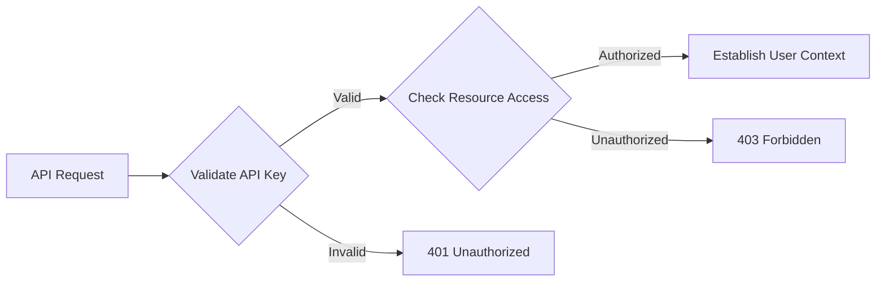
```mermaid
flowchart LR
    A[API Request] --> B{Validate API Key}
    B -->|Valid| C{Check Resource Access}
    B -->|Invalid| D[401 Unauthorized]
    C -->|Authorized| E[Establish User Context]
    C -->|Unauthorized| F[403 Forbidden]
```

- API key is validated
- Resource access is checked
- User context is established (if applicable)

#### OIDC Federated Login (SSO)

For UI access, VM-X AI supports OIDC federated login:

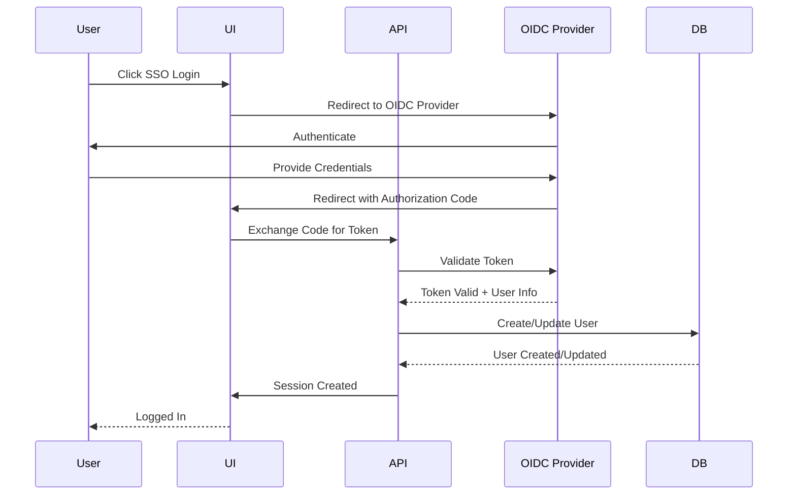
```mermaid
sequenceDiagram
    participant User
    participant UI
    participant API
    participant OIDC as OIDC Provider
    participant DB

    User->>UI: Click SSO Login
    UI->>OIDC: Redirect to OIDC Provider
    OIDC->>User: Authenticate
    User->>OIDC: Provide Credentials
    OIDC->>UI: Redirect with Authorization Code
    UI->>API: Exchange Code for Token
    API->>OIDC: Validate Token
    OIDC-->>API: Token Valid + User Info
    API->>DB: Create/Update User
    DB-->>API: User Created/Updated
    API->>UI: Session Created
    UI-->>User: Logged In
```

**OIDC Configuration:**

Configure via environment variables:

- `OIDC_FEDERATED_ISSUER`: OIDC issuer URL (required)
- `OIDC_FEDERATED_CLIENT_ID`: OIDC client ID (required)
- `OIDC_FEDERATED_CLIENT_SECRET`: OIDC client secret (optional)
- `OIDC_FEDERATED_SCOPE`: OIDC scopes (default: `openid profile email`)
- `OIDC_FEDERATED_DEFAULT_ROLE`: Default role for federated users (default: `power-user`)

When OIDC is configured, the login page displays an "SSO Login" button. After successful authentication, users are automatically created (if they don't exist) and assigned the default role.

### 3. Resource Resolution

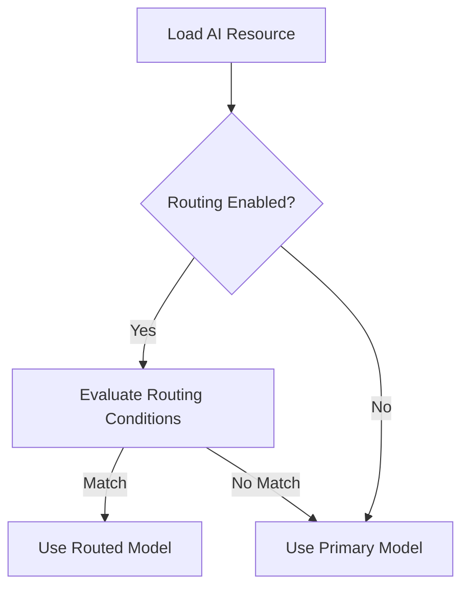
```mermaid
flowchart TD
    A[Load AI Resource] --> B{Routing Enabled?}
    B -->|Yes| C[Evaluate Routing Conditions]
    B -->|No| D[Use Primary Model]
    C -->|Match| E[Use Routed Model]
    C -->|No Match| D
```

- AI Resource is loaded from cache or database
- Routing conditions are evaluated
- Primary or routed model is selected

### 4. Capacity Check

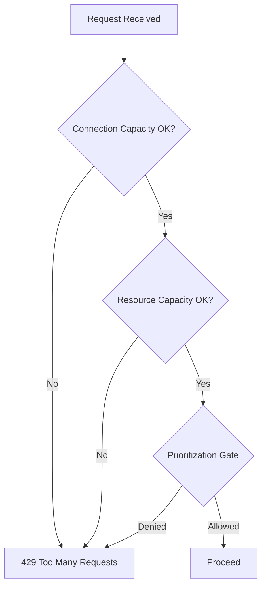
```mermaid
flowchart TD
    A[Request Received] --> B{Connection Capacity OK?}
    B -->|No| C[429 Too Many Requests]
    B -->|Yes| D{Resource Capacity OK?}
    D -->|No| C
    D -->|Yes| E{Prioritization Gate}
    E -->|Allowed| F[Proceed]
    E -->|Denied| C
```

- Connection-level capacity is checked (RPM, TPM)
- Resource-level capacity is checked
- Prioritization gate evaluates if request should proceed

### 5. Provider Request

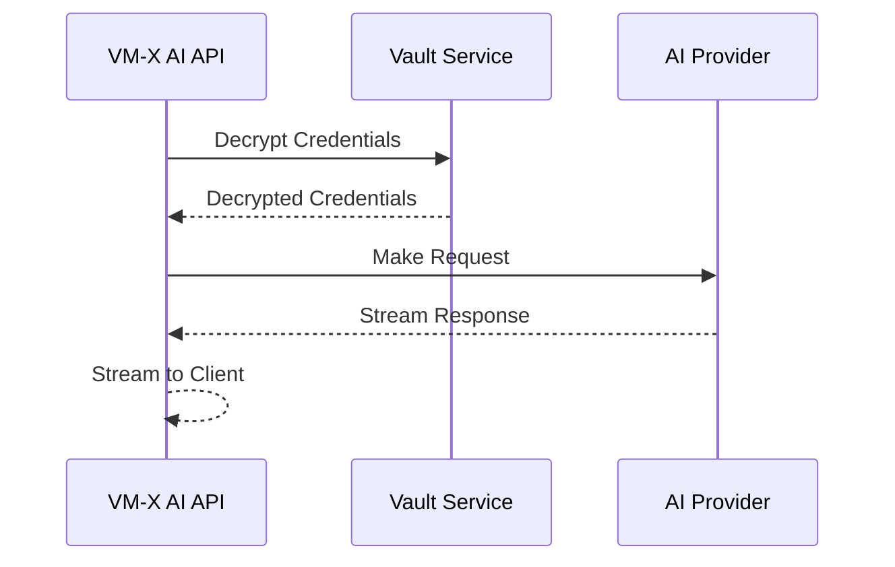
```mermaid
sequenceDiagram
    participant API as VM-X AI API
    participant Vault as Vault Service
    participant Provider as AI Provider

    API->>Vault: Decrypt Credentials
    Vault-->>API: Decrypted Credentials
    API->>Provider: Make Request
    Provider-->>API: Stream Response
    API-->>API: Stream to Client
```

- Credentials are decrypted (AWS KMS or Libsodium)
- Request is made to the selected AI provider
- Response is streamed back to the client

### 6. Fallback (if needed)

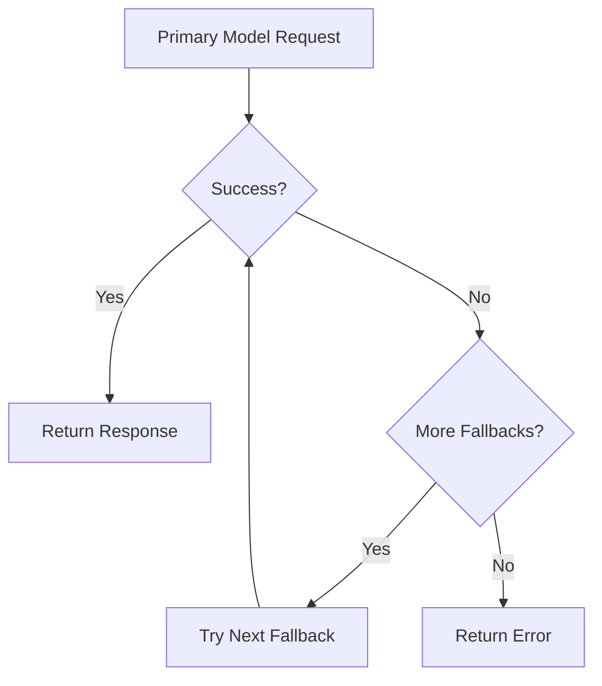
```mermaid
flowchart TD
    A[Primary Model Request] --> B{Success?}
    B -->|Yes| C[Return Response]
    B -->|No| D{More Fallbacks?}
    D -->|Yes| E[Try Next Fallback]
    D -->|No| F[Return Error]
    E --> B
```

- If primary model fails, fallback models are tried in order
- First successful response is returned
- All attempts are logged for analysis

### 7. Metrics & Audit

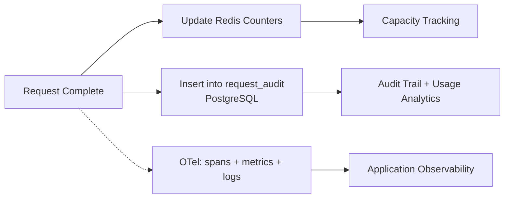
```mermaid
flowchart LR
    A[Request Complete] --> B[Update Redis Counters]
    A --> D[Insert into request_audit<br/>PostgreSQL]
    A -.-> E[OTel: spans + metrics + logs]

    B --> F[Capacity Tracking]
    D --> G[Audit Trail + Usage Analytics]
    E --> H[Application Observability]
```

- Capacity counters are updated in Redis
- A row is inserted into the Postgres `request_audit` table — this row powers both the audit-log viewer and the usage analytics dashboards (queried via SQL aggregations on demand)
- Application telemetry (traces, metrics, logs) is emitted via OpenTelemetry, independent of the audit/usage path

## Component Details

### API Server (NestJS)

**Key Modules:**

- **Gateway / Completion Module**: Hosts the three completion endpoints (`chat/completions`, `responses`, `anthropic/messages`) plus the routing, gate, and provider-dispatch services
- **AI Connection Module**: Manages provider connections
- **AI Resource Module**: Manages logical resources
- **API Key Module**: Manages API keys and access control
- **Pool Definition Module**: Capacity pools and prioritization configuration
- **Request Audit Module**: Writes the `request_audit` row for every completion (single source of truth for audit + usage)
- **Usage Module**: Reads `request_audit` and runs SQL aggregations to power the usage dashboards
- **Model Pricing Module**: Per-token pricing catalog used to compute cost for each audit row
- **Vault Module**: Handles credential encryption/decryption (AWS KMS or Libsodium)
- **Role Module**: Roles and policy-based authorization

**Key Services:**

- `CompletionService`: Main request handler for `chat/completions`
- `ResponsesService`: Handler for the Responses API endpoint
- `AnthropicMessagesService`: Handler for the Anthropic Messages endpoint
- `ResourceRoutingService`: Evaluates routing conditions
- `GateService`: Capacity and prioritization checks
- `AIConnectionService` / `AIResourceService`: Connection and resource management
- `RequestAuditService`: Writes the audit/usage row to Postgres
- `RequestUsageService` / `PostgresRequestUsageProvider`: Aggregates `request_audit` for dashboards

### UI Application (Next.js)

**Key Features:**

- **Workspace Management**: Multi-workspace support
- **Environment Management**: Isolated environments per workspace
- **AI Connection Management**: Create and configure connections
- **AI Resource Management**: Create and configure resources
- **API Key Management**: Generate and manage API keys
- **Audit Log Viewer**: Browse and filter completion logs
- **Usage Dashboard**: View usage metrics and charts
- **Prioritization Configuration**: Configure pool definitions

### Data Flow

#### Configuration Data

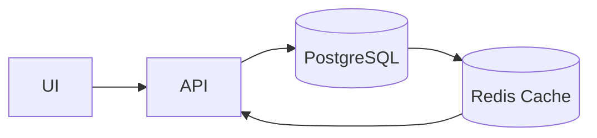
```mermaid
flowchart LR
    UI[UI] --> API[API]
    API --> PG[(PostgreSQL)]
    PG --> Cache[(Redis Cache)]
    Cache --> API
```

Configuration changes flow from UI to API, are stored in PostgreSQL, and cached in Redis for fast access.

#### Usage Analytics

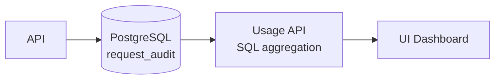
```mermaid
flowchart LR
    API[API] --> Audit[(PostgreSQL<br/>request_audit)]
    Audit --> UsageAPI[Usage API<br/>SQL aggregation]
    UsageAPI --> Dashboard[UI Dashboard]
```

Every completion writes a single row to `request_audit` (token counts, latency, cost JSONB, dimensions). The Usage API runs SQL aggregations (`date_trunc`, `percentile_cont`, JSONB extracts for cost/metadata) over that table on demand to power the UI dashboards. There is no separate time-series store.

#### Audit Logs

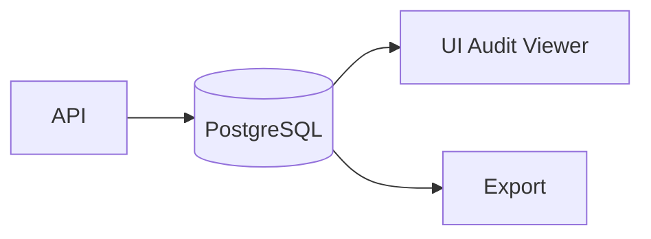
```mermaid
flowchart LR
    API[API] --> PG[(PostgreSQL)]
    PG --> UI[UI Audit Viewer]
    PG --> Export[Export]
```

Audit logs are stored in PostgreSQL and can be viewed in the UI or exported.

## Scalability

### Horizontal Scaling

- **API Pods**: Stateless, can scale horizontally
- **UI Pods**: Stateless, can scale horizontally
- **Redis**: Cluster mode for high availability
- **PostgreSQL**: Read replicas for read scaling

### Caching Strategy

- **AI Connections**: Cached in Redis with TTL
- **AI Resources**: Cached in Redis with TTL
- **Capacity Counters**: Stored in Redis with expiration
- **Database Queries**: Connection pooling for efficiency

### Performance Optimizations

- **Connection Pooling**: Separate read/write pools
- **Batch Operations**: Audit logs and metrics are batched
- **Async Processing**: Non-blocking operations where possible
- **Streaming Responses**: Support for streaming completions

## Security

### Encryption

- **At Rest**: Credentials encrypted in PostgreSQL
- **In Transit**: TLS/HTTPS for all communications
- **In Memory**: Credentials decrypted only when needed

### Access Control

- **API Keys**: Resource-level access control
- **Workspaces**: Multi-tenant isolation
- **Environments**: Additional isolation layer

### Audit

- **Complete Audit Trail**: Every request is logged
- **Immutable Logs**: Audit logs cannot be modified
- **Compliance Ready**: Structured for compliance requirements

## Observability

### Usage Metrics (from `request_audit`)

- **Request Count**: Total requests per resource/connection/model
- **Token Usage**: Prompt, completion, cached, reasoning, and total tokens
- **Latency**: Request duration, provider duration, gate duration, routing duration, time to first token, tokens per second
- **Error Rates**: Error counts, success counts, failure reasons
- **Cost**: Total/input/output/cached/reasoning cost (extracted from the `cost` JSONB column)
- **Capacity Usage**: RPM and TPM counters tracked in Redis for in-flight enforcement

### Traces

- **Distributed Tracing**: Full request lifecycle
- **Provider Calls**: Trace individual provider requests
- **Routing Decisions**: Trace routing condition evaluation
- **Capacity Checks**: Trace capacity and prioritization gates

### Logs

- **Structured Logging**: JSON logs with context
- **Request Logs**: All completion requests
- **Error Logs**: Detailed error information
- **Audit Logs**: Complete audit trail

## Deployment Options

VM-X AI can be deployed in various environments:

- **Local Development**: Docker Compose
- **Kubernetes**: Helm chart for any Kubernetes cluster
- **AWS EKS**: Complete CDK stack with EKS
- **AWS ECS**: Complete CDK stack with ECS Fargate

See the [Deployment Guides](../deployment/minikube) for detailed instructions.
