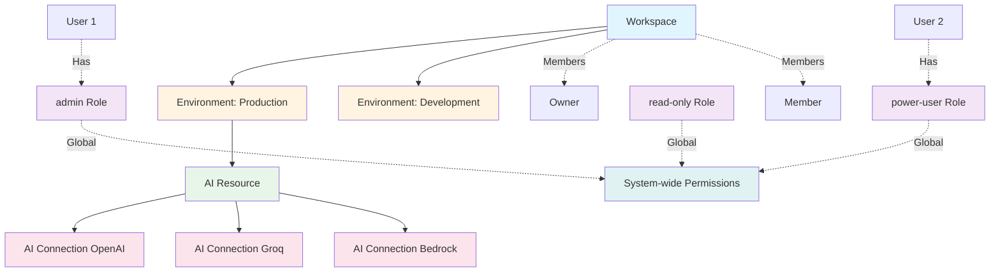

# Core Components

VM-X AI is built around several fundamental concepts that work together to provide a complete AI management solution. Understanding these components is essential for effectively using the platform.

## Workspaces and Environments

VM-X AI uses a hierarchical structure for organization and isolation:

### Workspaces

A **Workspace** is the top-level isolation layer that groups a set of environments. Workspaces provide:

- **Multi-tenancy**: Complete isolation between different organizations or teams
- **Access Control**: Workspace-level permissions and member management
- **Resource Organization**: Logical grouping of related environments

### Environments

An **Environment** is an isolation layer within a workspace that groups resources. Environments provide:

- **Resource Isolation**: AI Connections, AI Resources, API Keys, and Usage data are scoped to environments
- **Environment-based Routing**: Different environments can have different configurations
- **Deployment Separation**: Separate environments for development, staging, and production

### Workspace Members

Each workspace can have two types of members:

- **Owner**: Can do anything in the workspace, including deleting the workspace
- **Member**: Can create environments, AI connections, and resources, but cannot delete workspaces

## Users and Roles

VM-X AI provides fine-grained access control through **Users** and **Roles**. For detailed information, see the Security section:

- [Roles](../security/roles) - Role management and default roles
- [Policy](../security/policy) - Comprehensive policy guide
- [Users](../security/users) - User management

### Users

Users represent individuals who can access VM-X AI. Users can:

- Be assigned to workspaces as members or owners
- Have roles assigned for fine-grained permissions
- Access resources based on their permissions
- Authenticate via local credentials or OIDC federated login (SSO)

### OIDC Federated Login

VM-X AI supports OIDC (OpenID Connect) federated login for enterprise single sign-on (SSO). This allows users to authenticate using their organization's identity provider (e.g., Okta, Azure AD, Google Workspace).

**Configuration:**

Set the following environment variables to enable OIDC:

- `OIDC_FEDERATED_ISSUER`: The OIDC issuer URL (required)
- `OIDC_FEDERATED_CLIENT_ID`: The OIDC client ID (required)
- `OIDC_FEDERATED_CLIENT_SECRET`: The OIDC client secret (optional, depending on provider)
- `OIDC_FEDERATED_SCOPE`: OIDC scopes (default: `openid profile email`)
- `OIDC_FEDERATED_DEFAULT_ROLE`: Default role assigned to federated users (default: `power-user`)

When OIDC is configured, the login page displays an "SSO Login" button that redirects users to the identity provider for authentication. After successful authentication, users are automatically created in VM-X AI (if they don't exist) and assigned the default role.

### Roles

Roles manage permissions using granular policies. Each role defines:

- **Actions**: What operations can be performed (e.g., `ai-connection:create`, `workspace:delete`)
- **Resources**: What resources can be accessed (e.g., `workspace:*`, `environment:production`)
- **Effect**: Whether to allow or deny the action (ALLOW or DENY)

Roles support wildcards for flexible permission management:

- `*` matches any value
- `?` matches a single character

### Default Roles

VM-X AI includes three default roles:

- **admin**: Full access to everything (`*:*` on `*`)
- **power-user**: Can create workspaces, environments, connections, and resources, but cannot manage roles or users
- **read-only**: Can only read/list resources (`*:get`, `*:list` on `*`)

## AI Connections and AI Resources

VM-X AI is built around two fundamental concepts: **AI Connections** and **AI Resources**.

## AI Connections

An **AI Connection** represents a connection to a specific AI provider with its credentials and capacity configuration.

### What is an AI Connection?

An AI Connection encapsulates:

- **Provider**: The AI provider (OpenAI, Anthropic, Google Gemini, Groq, AWS Bedrock)
- **Credentials**: Encrypted API keys or authentication tokens
- **Capacity**: Custom capacity limits (e.g., 100 RPM, 100,000 TPM)
- **Discovered Capacity**: Automatically discovered rate limits from the provider

### Key Features

#### 🔐 **Secure Credential Storage**

Credentials are encrypted at rest using either:

- **AWS KMS**: For production environments (recommended)
- **Libsodium**: For local development and small deployments

Credentials are never exposed in API responses or logs.

#### 📊 **Capacity Management**

Define custom capacity limits per connection:

```json
{
  "capacity": [
    {
      "period": "minute",
      "requests": 100,
      "tokens": 100000
    },
    {
      "period": "hour",
      "requests": 5000,
      "tokens": 5000000
    },
    {
      "period": "day",
      "requests": 100000,
      "tokens": 100000000
    }
  ]
}
```

#### 🔍 **Discovered Capacity**

VM-X AI automatically discovers rate limits from provider responses and stores them as "discovered capacity". This helps you understand actual provider limits and optimize your usage.

## AI Resources

An **AI Resource** represents a logical endpoint that your applications use to make AI requests. It defines which provider/model to use, routing rules, fallback behavior, and capacity allocation.

### What is an AI Resource?

An AI Resource is the abstraction your applications interact with. It includes:

- **Primary Model**: The default provider/model to use
- **Routing Rules**: Conditions for dynamically selecting different models
- **Fallback Models**: Alternative models to use if the primary fails
- **Capacity**: Resource-level capacity limits
- **API Key Assignment**: Which API keys can access this resource

### Key Features

#### 🎯 **Dynamic Routing**

Route requests to different models based on conditions. VM-X AI provides a comprehensive set of routing conditions:

**Available Routing Expressions:**

- `tokens.input` - Number of input tokens in the request
- `request.allMessagesContent.length` - Total character length of all messages
- `request.lastMessage.content` - Content of the last user message
- `request.allMessagesContent` - Combined content of all messages
- `request.toolsCount` - Number of tools in the request
- `errorRate(5)` - Error rate in the last 5 minutes
- `errorRate(10)` - Error rate in the last 10 minutes

**Available Comparators:**

- `LESS_THAN` - Field is less than value
- `GREATER_THAN` - Field is greater than value
- `CONTAINS` - Field contains value (for strings)
- `PATTERN` - Field matches regex pattern (for strings)

**Example: Route based on input token count**

```json
{
  "routing": {
    "enabled": true,
    "conditions": [
      {
        "description": "Use Groq for small requests",
        "expression": "tokens.input",
        "comparator": "LESS_THAN",
        "value": {
          "type": "NUMBER",
          "value": 100
        },
        "then": {
          "provider": "groq",
          "connectionId": "groq-connection-id",
          "model": "llama-3.1-70b-versatile"
        }
      }
    ]
  }
}
```

**Example: Route based on error rate**

```json
{
  "routing": {
    "enabled": true,
    "conditions": [
      {
        "description": "Switch to Anthropic if error rate is high",
        "expression": "errorRate(10)",
        "comparator": "GREATER_THAN",
        "value": {
          "type": "NUMBER",
          "value": 10
        },
        "then": {
          "provider": "anthropic",
          "connectionId": "anthropic-connection-id",
          "model": "claude-3-5-sonnet-20241022"
        }
      }
    ]
  }
}
```

**Example: Route based on tools usage**

```json
{
  "routing": {
    "enabled": true,
    "conditions": [
      {
        "description": "Use GPT-4 for requests with tools",
        "expression": "request.toolsCount",
        "comparator": "GREATER_THAN",
        "value": {
          "type": "NUMBER",
          "value": 0,
          "readOnly": true
        },
        "then": {
          "provider": "openai",
          "connectionId": "openai-connection-id",
          "model": "gpt-4o"
        }
      }
    ]
  }
}
```

**Example: Route based on message content**

```json
{
  "routing": {
    "enabled": true,
    "conditions": [
      {
        "description": "Route urgent requests to GPT-4",
        "expression": "request.lastMessage.content",
        "comparator": "CONTAINS",
        "value": {
          "type": "STRING",
          "value": "urgent"
        },
        "then": {
          "provider": "openai",
          "connectionId": "openai-connection-id",
          "model": "gpt-4o"
        }
      }
    ]
  }
}
```

**Example: Route based on character length**

```json
{
  "routing": {
    "enabled": true,
    "conditions": [
      {
        "description": "Use Groq for short prompts",
        "expression": "request.allMessagesContent.length",
        "comparator": "LESS_THAN",
        "value": {
          "type": "NUMBER",
          "value": 500
        },
        "then": {
          "provider": "groq",
          "connectionId": "groq-connection-id",
          "model": "llama-3.1-70b-versatile"
        }
      }
    ]
  }
}
```

#### 🔄 **Automatic Fallback**

Configure fallback models that are automatically used if the primary model fails:

```json
{
  "useFallback": true,
  "fallbackModels": [
    {
      "provider": "bedrock",
      "connectionId": "bedrock-connection-id",
      "model": "anthropic.claude-3-5-sonnet-20241022-v2:0"
    },
    {
      "provider": "openai",
      "connectionId": "openai-connection-id",
      "model": "gpt-4o-mini"
    }
  ]
}
```

Fallback happens automatically on:

- Provider errors (5xx status codes)
- Rate limit errors (429)
- Timeout errors
- Network failures

#### 📊 **Resource-Level Capacity**

Define capacity limits specific to a resource:

```json
{
  "capacity": [
    {
      "period": "minute",
      "requests": 50,
      "tokens": 50000
    }
  ],
  "enforceCapacity": true
}
```

This allows you to:

- Limit usage per resource independently
- Control costs by resource
- Implement tiered access levels

#### 🔑 **API Key Assignment**

Assign API keys to resources to control access:

```json
{
  "assignApiKeys": ["api-key-id-1", "api-key-id-2"]
}
```

Only requests with assigned API keys can access the resource.

## Relationship Between Components



:::info Roles are Global
Roles are **global** and not scoped to workspaces or environments. A role's permissions apply across all workspaces and environments in the system. Users are assigned roles globally, and those roles determine what actions they can perform throughout the entire VM-X AI instance.
:::

### How They Work Together

1. **Application** makes a request to an **AI Resource** using an API key
2. **AI Resource** evaluates routing conditions to select a model
3. **AI Resource** uses the appropriate **AI Connection** to make the request
4. If the primary model fails, **AI Resource** automatically tries fallback models
5. Capacity is checked at both the connection and resource levels
6. All requests are logged for audit and metrics

## Best Practices

### AI Connections

- **One connection per provider account**: Create separate connections for different provider accounts or regions
- **Set realistic capacity**: Base capacity limits on provider quotas and your usage patterns
- **Use discovered capacity**: Monitor discovered capacity to understand actual provider limits

### AI Resources

- **Start simple**: Begin with a single primary model, add routing and fallback as needed
- **Test routing conditions**: Verify routing logic works as expected before deploying
- **Configure fallback chains**: Always have at least one fallback model for critical resources
- **Set resource capacity**: Use resource-level capacity to control costs and ensure fair usage
- **Use API keys for access control**: Assign API keys to resources to implement access control
