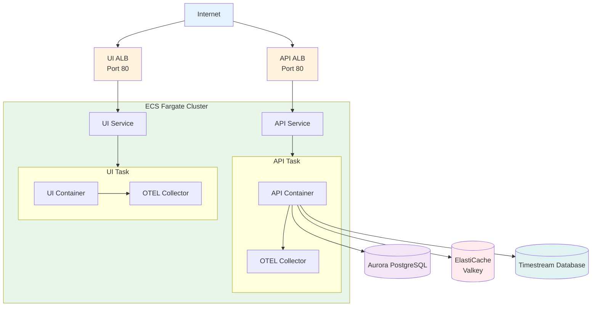

# Deploying to AWS ECS

This guide shows you how to deploy VM-X AI to Amazon ECS (Elastic Container Service) using AWS CDK with Fargate.

## Overview

The AWS ECS example provides a complete production-ready infrastructure including:

- **ECS Fargate Cluster** for container orchestration
- **VPC** with multi-AZ networking
- **Aurora PostgreSQL** for the primary database
- **AWS Timestream** for time-series metrics
- **ElastiCache Serverless (Valkey)** for Redis-compatible caching
- **Application Load Balancers** for API and UI services
- **OpenTelemetry Collector** for observability
- **AWS KMS** for encryption
- **CloudWatch Logs** for centralized logging

## Prerequisites

Before you begin, ensure you have:

- **AWS CLI** configured with appropriate credentials
- **AWS CDK CLI** installed (`npm install -g aws-cdk`)
- **Node.js** 18+ and **pnpm** (or npm/yarn)
- **AWS Permissions** to create:
  - ECS clusters and services
  - VPCs, subnets, and networking resources
  - RDS Aurora clusters
  - Timestream databases
  - ElastiCache serverless caches
  - KMS keys
  - IAM roles and policies
  - Security groups
  - Application Load Balancers
  - CloudWatch Log Groups
  - SSM Parameters

## Quick Start

### 1. Get the ECS Example

The ECS example is available in the [examples/aws-cdk-ecs](https://github.com/vm-x-ai/open-vm-x-ai/tree/main/examples/aws-cdk-ecs) directory.

If you have the repository cloned, navigate to:

```bash
cd examples/aws-cdk-ecs
```

Otherwise, download or clone the repository to access the example.

### 2. Install Dependencies

```bash
pnpm install
```

### 3. Bootstrap CDK (First Time Only)

If this is your first time using CDK in this AWS account/region:

```bash
pnpm cdk bootstrap
```

### 4. Deploy the Stack

```bash
pnpm cdk deploy
```

This will:
- Create the VPC and networking infrastructure
- Provision the ECS Fargate cluster
- Create the Aurora PostgreSQL database
- Create the Timestream database
- Create the ElastiCache serverless cache
- Create the KMS encryption key
- Deploy the API and UI services
- Configure all IAM roles and policies
- Set up Application Load Balancers

**Deployment typically takes 15-30 minutes.**

### 5. Get Application URLs

After deployment, retrieve the application URLs:

```bash
aws cloudformation describe-stacks \
  --stack-name vm-x-ai-ecs-example \
  --query 'Stacks[0].Outputs' \
  --output table
```

Or check the AWS Console for the Load Balancer DNS names:
- **ApiUrl**: API Load Balancer DNS name
- **UiUrl**: UI Load Balancer DNS name

## Architecture

The stack creates:



## CDK Stack Overview

The ECS stack is defined in [`examples/aws-cdk-ecs/lib/ecs-stack.ts`](https://github.com/vm-x-ai/open-vm-x-ai/blob/main/examples/aws-cdk-ecs/lib/ecs-stack.ts). Here's a breakdown of the key components:

### VPC Configuration

The stack creates a VPC with public subnets:

```typescript
const vpc = new Vpc(this, 'VPC', {
  vpcName: 'vm-x-ai-example-vpc',
  ipAddresses: IpAddresses.cidr('10.0.0.0/16'),
  maxAzs: 3,
  subnetConfiguration: [
    {
      cidrMask: 24,
      name: 'Public',
      subnetType: SubnetType.PUBLIC,
    },
  ],
});
```

**Key Points:**
- **CIDR**: `10.0.0.0/16` provides 65,536 IP addresses
- **Availability Zones**: 3 AZs for high availability
- **Subnets**: Public subnets only (add private subnets with NAT Gateway for production)

### Aurora PostgreSQL Database

The stack creates an Aurora PostgreSQL cluster:

```typescript
const database = new DatabaseCluster(this, 'Database', {
  engine: DatabaseClusterEngine.auroraPostgres({
    version: AuroraPostgresEngineVersion.VER_17_6,
  }),
  vpc,
  clusterIdentifier: 'vm-x-ai-rds-cluster',
  vpcSubnets: {
    subnetType: SubnetType.PUBLIC,  // Production: Use PRIVATE_WITH_EGRESS
  },
  writer: ClusterInstance.provisioned('writer', {
    publiclyAccessible: true,  // Production: Set to false
    instanceType: InstanceType.of(
      InstanceClass.BURSTABLE3,
      InstanceSize.MEDIUM
    ),
  }),
  credentials: Credentials.fromGeneratedSecret('vmxai', {
    secretName: 'vm-x-ai-database-secret',
  }),
  defaultDatabaseName: 'vmxai',
});
```

**Key Points:**
- **Engine**: Aurora PostgreSQL 17.6
- **Instance Type**: `db.t3.medium` (burstable performance)
- **Credentials**: Auto-generated and stored in AWS Secrets Manager
- **Network**: Publicly accessible for development (use private subnets in production)

### ElastiCache Serverless (Valkey)

The stack creates a serverless Valkey (Redis-compatible) cache:

```typescript
const redisSecurityGroup = new SecurityGroup(
  this,
  'ElastiCacheSecurityGroup',
  {
    vpc,
    allowAllOutbound: true,
    description: 'ElastiCache Security Group',
  }
);

const redisCluster = new CfnServerlessCache(this, 'ServerlessCache', {
  engine: 'valkey',
  serverlessCacheName: 'vm-x-ai-valkey-serverless-cache',
  securityGroupIds: [redisSecurityGroup.securityGroupId],
  subnetIds: vpc.publicSubnets.map((subnet) => subnet.subnetId),
  majorEngineVersion: '7',
});
```

**Key Points:**
- **Engine**: Valkey (Redis-compatible)
- **Mode**: Serverless (auto-scaling)
- **Network**: Public subnets (use private subnets in production)

### ECS Fargate Cluster

The stack creates an ECS Fargate cluster:

```typescript
const cluster = new Cluster(this, 'Cluster', {
  clusterName: 'vm-x-ai-cluster',
  vpc,
});
```

**Key Points:**
- **Launch Type**: Fargate (serverless containers)
- **No EC2 Management**: Fargate handles infrastructure

### Application Load Balancers

The stack creates separate ALBs for API and UI:

```typescript
const apiLoadBalancer = new ApplicationLoadBalancer(
  this,
  'API/LoadBalancer',
  {
    vpc,
    loadBalancerName: 'vm-x-ai-api',
    internetFacing: true,
    vpcSubnets: {
      subnetType: SubnetType.PUBLIC,
    },
    http2Enabled: true,
  }
);

const uiLoadBalancer = new ApplicationLoadBalancer(
  this,
  'UI/LoadBalancer',
  {
    vpc,
    loadBalancerName: 'vm-x-ai-ui',
    internetFacing: true,
    vpcSubnets: {
      subnetType: SubnetType.PUBLIC,
    },
    http2Enabled: true,
  }
);
```

**Key Points:**
- **Separate ALBs**: One for API, one for UI
- **HTTP/2**: Enabled for better performance
- **Internet-facing**: Public access (use internal ALBs in production)

### Fargate Task Definitions

The stack creates task definitions for API and UI:

```typescript
const apiTaskDefinition = new FargateTaskDefinition(this, 'API/TaskDef', {
  memoryLimitMiB: 1024,
  cpu: 512,
  family: 'vm-x-ai-api-task-definition',
});

const uiTaskDefinition = new FargateTaskDefinition(this, 'UI/TaskDef', {
  memoryLimitMiB: 1024,
  cpu: 512,
  family: 'vm-x-ai-ui-task-definition',
});
```

**Key Points:**
- **Memory**: 1024 MiB per task
- **CPU**: 512 CPU units (0.5 vCPU)
- **Containers**: Each task includes application container and OTEL collector sidecar

### Container Configuration

The API container is configured with environment variables and secrets:

```typescript
apiTaskDefinition.addContainer('API/Container', {
  image: ContainerImage.fromRegistry('vmxai/api:latest'),
  portMappings: [{ containerPort: 3000 }],
  containerName: 'api',
  environment: {
    LOG_LEVEL: 'info',
    NODE_ENV: 'production',
    PORT: '3000',
    BASE_URL: `http://${apiLoadBalancer.loadBalancerDnsName}`,
    UI_BASE_URL: `http://${uiLoadBalancer.loadBalancerDnsName}`,
    REDIS_HOST: redisCluster.attrEndpointAddress,
    REDIS_PORT: redisCluster.attrEndpointPort,
    REDIS_MODE: 'cluster',
    ENCRYPTION_PROVIDER: 'aws-kms',
    AWS_KMS_KEY_ID: encryptionKey.keyArn,
    COMPLETION_USAGE_PROVIDER: 'aws-timestream',
    AWS_TIMESTREAM_DATABASE_NAME: timestreamDatabase.databaseName!,
    OTEL_ENABLED: 'true',
    OTEL_EXPORTER_OTLP_ENDPOINT: 'http://localhost:4318',
  },
  secrets: {
    DATABASE_HOST: ECSSecret.fromSecretsManager(database.secret!, 'host'),
    DATABASE_PORT: ECSSecret.fromSecretsManager(database.secret!, 'port'),
    DATABASE_DB_NAME: ECSSecret.fromSecretsManager(database.secret!, 'dbname'),
    DATABASE_USER: ECSSecret.fromSecretsManager(database.secret!, 'username'),
    DATABASE_PASSWORD: ECSSecret.fromSecretsManager(database.secret!, 'password'),
  },
});
```

**Key Points:**
- **Image**: Uses published `vmxai/api:latest` image
- **Secrets**: Retrieved from AWS Secrets Manager
- **OpenTelemetry**: Enabled with sidecar collector
- **AWS Services**: KMS for encryption, Timestream for metrics

### Fargate Services

The stack creates Fargate services:

```typescript
const apiService = new FargateService(this, 'API/Service', {
  cluster,
  serviceName: 'vm-x-ai-api',
  enableExecuteCommand: true,
  desiredCount: 1,
  vpcSubnets: {
    subnetType: SubnetType.PUBLIC,  // Production: Use PRIVATE_WITH_EGRESS
  },
  taskDefinition: apiTaskDefinition,
  assignPublicIp: true,  // Production: Set to false
});
```

**Key Points:**
- **Desired Count**: 1 task (can be scaled)
- **Public IP**: Enabled for development (disable in production)
- **Execute Command**: Enabled for debugging

### Load Balancer Targets

The stack configures ALB target groups:

```typescript
apiListener.addTargets('API/Target', {
  targetGroupName: 'vm-x-ai-api-target-group',
  port: 3000,
  targets: [
    apiService.loadBalancerTarget({
      containerName: 'api',
      containerPort: 3000,
    }),
  ],
  healthCheck: {
    path: '/healthcheck',
    interval: cdk.Duration.seconds(30),
    healthyHttpCodes: '200',
  },
});
```

**Key Points:**
- **Health Checks**: Configured on `/healthcheck` endpoint
- **Port**: 3000 for API, 3001 for UI
- **Protocol**: HTTP (add HTTPS in production)

## Complete Example

For the complete CDK stack implementation, see the [ECS example directory](https://github.com/vm-x-ai/open-vm-x-ai/tree/main/examples/aws-cdk-ecs).

The example includes:
- Complete CDK stack code
- All infrastructure components
- IAM roles and policies
- Task definitions and services
- Load balancer configuration

## Configuration

### Task Resources

Default task configuration:

- **API Task**: 1024 MiB memory, 512 CPU units
- **UI Task**: 1024 MiB memory, 512 CPU units
- **OTEL Collector**: 512 MiB memory, 256 CPU units

Modify in `lib/ecs-stack.ts`:

```typescript
const apiTaskDefinition = new FargateTaskDefinition(this, 'API/TaskDef', {
  memoryLimitMiB: 2048,  // Increase memory
  cpu: 1024,              // Increase CPU
  family: 'vm-x-ai-api-task-definition',
});
```

### Service Desired Count

Default is 1 task per service. Modify:

```typescript
const apiService = new FargateService(this, 'API/Service', {
  // ...
  desiredCount: 2,  // Scale to 2 tasks
});
```

### OpenTelemetry Configuration

The OpenTelemetry collector configuration is stored in [`ecs-otel-config.yaml`](https://github.com/vm-x-ai/open-vm-x-ai/blob/main/examples/aws-cdk-ecs/ecs-otel-config.yaml) and uploaded to SSM Parameter Store. Customize by editing the file.

The configuration file defines receivers, processors, and exporters for traces and metrics:

```yaml
extensions:
  health_check:
receivers:
  otlp:
    protocols:
      grpc:
        endpoint: 0.0.0.0:4317
      http:
        endpoint: 0.0.0.0:4318
  awsxray:
    endpoint: 0.0.0.0:2000
    transport: udp
  statsd:
    endpoint: 0.0.0.0:8125
    aggregation_interval: 60s

processors:
  batch/traces:
    timeout: 1s
    send_batch_size: 50
  batch/metrics:
    timeout: 60s

exporters:
  awsxray:
  awsemf:
    namespace: ECS/OTEL/VM-X-AI
    log_group_name: '/aws/ecs/application/metrics'

service:
  pipelines:
    traces:
      receivers: [otlp, awsxray]
      processors: [batch/traces]
      exporters: [awsxray]
    metrics:
      receivers: [otlp, statsd]
      processors: [batch/metrics]
      exporters: [awsemf]

  extensions: [health_check]
```

**Key Configuration Points:**
- **Receivers**: OTLP (gRPC and HTTP), AWS X-Ray, and StatsD
- **Processors**: Batch processing for traces and metrics
- **Exporters**: AWS X-Ray for traces, CloudWatch EMF for metrics
- **Namespace**: Metrics exported to `ECS/OTEL/VM-X-AI` namespace in CloudWatch

:::warning CloudWatch Metric Costs
OpenTelemetry can generate a large number of metrics with multiple dimensions (labels/tags). CloudWatch charges **$0.30 per metric per month**, and each unique combination of metric name and dimension values counts as a separate metric.

**High-cardinality metrics** (metrics with many unique dimension combinations) can quickly become expensive. For example:
- A metric with 3 dimensions, each with 10 possible values = up to 1,000 unique metrics
- At $0.30/metric/month, this could cost $300/month for a single metric type

**Recommendations:**
- Monitor your CloudWatch metric count regularly
- Consider reducing metric dimensions if costs become high
- Use metric filtering or aggregation to reduce cardinality
- Review and disable unnecessary metrics in your OpenTelemetry configuration
- Set up CloudWatch billing alarms to track metric costs

You can check your current metric count:
```bash
aws cloudwatch list-metrics --namespace ECS/OTEL/VM-X-AI --query 'length(Metrics)'
```
:::

## Accessing Services

### Application

Access the application at the Load Balancer DNS names:
- **UI**: `http://<ui-alb-dns-name>`
- **API**: `http://<api-alb-dns-name>`

Default credentials:
- **Username**: `admin`
- **Password**: `admin`

### CloudWatch Logs

View logs for all services:

```bash
# API logs
aws logs tail /aws/ecs/vm-x-ai-api --follow

# UI logs
aws logs tail /aws/ecs/vm-x-ai-ui --follow

# Collector logs
aws logs tail /aws/ecs/vm-x-ai-collector --follow
```

### AWS X-Ray

Traces are automatically sent to AWS X-Ray. View them in the AWS X-Ray console or via CLI:

```bash
aws xray get-trace-summaries \
  --start-time $(date -u -d '1 hour ago' +%s) \
  --end-time $(date -u +%s)
```

## Secrets Management

The stack uses **AWS Secrets Manager** and **SSM Parameter Store**:

- **Database Credentials**: Stored in Secrets Manager (`vm-x-ai-database-secret`)
  - Automatically generated when Aurora cluster is created
  - Contains: `host`, `port`, `dbname`, `username`, `password`
- **UI Auth Secret**: Stored in Secrets Manager (`vm-x-ai-ui-auth-secret`)
  - Auto-generated 32-character secret
- **OpenTelemetry Config**: Stored in SSM Parameter Store (`vm-x-ai-otel-config`)
  - Contains collector configuration from `ecs-otel-config.yaml`
- **KMS Key**: Referenced by ARN (no secret needed)

## Monitoring and Observability

The stack includes:

- **CloudWatch Logs**: All container logs
- **AWS X-Ray**: Distributed tracing for API requests
- **CloudWatch Metrics**: Custom metrics via OpenTelemetry EMF exporter
- **Health Checks**: ALB health checks on `/healthcheck` endpoints

:::warning CloudWatch Metric Costs
OpenTelemetry metrics exported to CloudWatch can generate high costs due to metric cardinality. Each unique combination of metric name and dimension values is billed as a separate metric at **$0.30 per metric per month**. Monitor your metric count and consider reducing dimensions if costs become high.
:::

### Viewing Metrics

Metrics are exported to CloudWatch under namespace `ECS/OTEL/VM-X-AI`:

```bash
aws cloudwatch list-metrics --namespace ECS/OTEL/VM-X-AI
```

To check the total number of metrics (which affects billing):

```bash
aws cloudwatch list-metrics --namespace ECS/OTEL/VM-X-AI --query 'length(Metrics)'
```

## Cost Considerations

Estimated monthly costs for minimal production setup:

- **ECS Fargate**: ~$30-50/month (0.04/vCPU-hour + 0.004/GB-hour)
- **Application Load Balancers**: ~$32/month (2 ALBs × $0.0225/hour)
- **Aurora PostgreSQL**: $100-200/month (db.t3.medium)
- **ElastiCache Serverless**: $10-30/month (pay-per-use)
- **Timestream**: $10-50/month (pay-per-use)
- **Data Transfer**: ~$0.09/GB for outbound
- **CloudWatch Logs**: ~$0.50/GB ingested, $0.03/GB stored
- **CloudWatch Metrics**: **$0.30 per metric per month** (can be significant with high-cardinality OpenTelemetry metrics)

**Total**: $200-400/month (excluding CloudWatch metrics, which can add $50-500+ depending on metric cardinality)

:::important CloudWatch Metrics Cost
CloudWatch metrics can become a significant cost driver, especially with OpenTelemetry. Each unique combination of metric name and dimension values is billed separately. For example:
- 100 unique metrics = $30/month
- 1,000 unique metrics = $300/month
- 10,000 unique metrics = $3,000/month

Monitor your metric count and consider:
- Reducing metric dimensions
- Filtering or aggregating metrics
- Disabling unnecessary metrics
- Setting up CloudWatch billing alarms
:::

To reduce costs:
- Use smaller task sizes (reduce CPU/memory)
- Reduce desired count to 0 when not in use
- Use Aurora Serverless v2 for variable workloads
- Disable optional components
- Use single-AZ deployment (not recommended for production)

## Troubleshooting

### Check Task Status

```bash
# List tasks
aws ecs list-tasks --cluster vm-x-ai-cluster --service-name vm-x-ai-api

# Describe task
aws ecs describe-tasks --cluster vm-x-ai-cluster --tasks <task-arn>

# Task logs
aws logs tail /aws/ecs/vm-x-ai-api --follow
```

### Check Service Status

```bash
# Describe service
aws ecs describe-services \
  --cluster vm-x-ai-cluster \
  --services vm-x-ai-api vm-x-ai-ui
```

### Check Load Balancer

```bash
# Describe load balancer
aws elbv2 describe-load-balancers --names vm-x-ai-api vm-x-ai-ui

# Check target health
aws elbv2 describe-target-health \
  --target-group-arn <target-group-arn>
```

### Common Issues

1. **Tasks stuck in Pending**: Check security group rules and VPC configuration
2. **Tasks failing health checks**: Verify health check path and container configuration
3. **Database connection failures**: Check security group rules and VPC configuration
4. **Secrets not accessible**: Verify IAM role permissions for Secrets Manager

## Cleanup

To destroy all resources:

```bash
pnpm cdk destroy
```

**Warning**: This will delete all resources including databases and caches. Make sure you have backups if needed.

**Note**: Some resources may need to be deleted manually:
- ElastiCache serverless cache (may take time to delete)
- Timestream database (must be empty before deletion)

## Customization

### Add Auto Scaling

Add Application Auto Scaling to automatically scale services:

```typescript
import { ScalableTarget, ServiceNamespace, MetricType } from 'aws-cdk-lib/aws-applicationautoscaling';

const scalableTarget = apiService.autoScaleTaskCount({
  minCapacity: 1,
  maxCapacity: 10,
});

scalableTarget.scaleOnCpuUtilization('CpuScaling', {
  targetUtilizationPercent: 70,
});
```

### Use Private Subnets (Production)

For production, move resources to private subnets:

```typescript
vpcSubnets: {
  subnetType: SubnetType.PRIVATE_WITH_EGRESS,  // Instead of PUBLIC
},
assignPublicIp: false,  // Instead of true
```

## Security Best Practices

For production deployments:

1. **Private Subnets**: Move all resources to private subnets with NAT Gateway
2. **Security Groups**: Implement least-privilege security group rules
3. **Secrets Rotation**: Enable automatic secret rotation in Secrets Manager
4. **Encryption**: Ensure all data at rest is encrypted
5. **Backup**: Enable automated backups for Aurora
6. **Monitoring**: Set up CloudWatch alarms for service health
7. **Access Control**: Use least-privilege IAM policies
8. **HTTPS**: Configure SSL/TLS certificates for load balancers
9. **VPC Endpoints**: Use VPC endpoints for AWS services
10. **Network ACLs**: Implement network ACLs for additional security

## Production Checklist

Before deploying to production:

- [ ] Move database to private subnets
- [ ] Move ElastiCache to private subnets
- [ ] Disable public IP assignment for tasks
- [ ] Configure HTTPS/TLS on load balancers
- [ ] Set up custom domain names
- [ ] Enable database backups
- [ ] Configure auto-scaling
- [ ] Set up CloudWatch alarms
- [ ] Review and tighten IAM policies
- [ ] Enable VPC Flow Logs
- [ ] Configure WAF on load balancers
- [ ] Set up disaster recovery plan

## Next Steps

- [AWS EKS Deployment](./aws-eks.md) - Alternative AWS deployment option
- [Minikube Deployment](./minikube.md) - Local Kubernetes deployment
- [ECS Example README](https://github.com/vm-x-ai/open-vm-x-ai/blob/main/examples/aws-cdk-ecs/README.md) - Detailed example documentation

