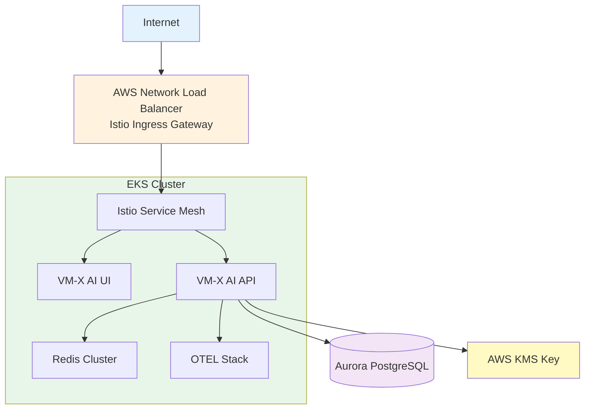

# Deploying to AWS EKS

This guide shows you how to deploy VM-X AI to Amazon EKS (Elastic Kubernetes Service) using AWS CDK and the provided example stack.

## What gets deployed

VM-X AI itself only requires four runtime components: the **API**, the **UI**, **PostgreSQL**, and **Redis**. The API exposes three OpenAI/Anthropic-compatible gateway surfaces (Chat Completions, Responses, and Anthropic Messages) on a single port. Usage analytics and cost tracking are served directly from the `request_audit` table in Postgres, so there is no separate time-series database.

The EKS example wraps those four with a production-grade AWS footprint:

**Required for VM-X AI to run**

- **EKS Cluster** with managed node pools (Auto Mode, `system` + `general-purpose`)
- **VPC** with multi-AZ networking
- **Aurora PostgreSQL** as the primary database (also stores `request_audit`)
- **Redis cluster** (3-node, deployed by the Helm chart)
- **Encryption provider** for AI provider credentials. The Helm chart defaults to **libsodium** (symmetric key auto-generated as a Kubernetes secret, see [helm/charts/vm-x-ai/SECRETS.md](https://github.com/vm-x-ai/vm-x-ai/blob/main/helm/charts/vm-x-ai/SECRETS.md)). The EKS example overrides this to **AWS KMS** envelope encryption.

**Optional, deployed by default**

- **Istio Service Mesh** for ingress, mTLS, and traffic management
- **OpenTelemetry stack** (collector + Jaeger + Prometheus + Loki + Grafana) — application observability for the gateway, not VM-X AI's product features
- **External Secrets Operator** to sync the database credentials from AWS Secrets Manager into Kubernetes

## Prerequisites

Before you begin, ensure you have:

- **AWS CLI** configured with appropriate credentials
- **AWS CDK CLI** installed (`npm install -g aws-cdk`)
- **Node.js** 18+ and **pnpm** (or npm/yarn)
- **kubectl** installed
- **Helm** 3.0+ installed (optional)
- **AWS Permissions** to create:
  - EKS clusters and node groups
  - VPCs, subnets, and networking resources
  - RDS Aurora clusters
  - KMS keys
  - IAM roles and policies
  - Security groups
  - Load balancers

## Quick Start

### 1. Get the EKS Example

The EKS example is available in the [examples/aws-cdk-eks](https://github.com/vm-x-ai/vm-x-ai/tree/main/examples/aws-cdk-eks) directory.

If you have the repository cloned, navigate to:

```bash
cd examples/aws-cdk-eks
```

Otherwise, download or clone the repository to access the example.

### 2. Install Dependencies

```bash
pnpm install
```

### 3. Configure Admin Role

**Important**: Update the admin role ARN in `lib/eks-stack.ts`:

```typescript
const adminRoleArn = `arn:aws:iam::${this.account}:role/your-admin-role`;
```

Replace with your IAM role ARN that should have admin access to the cluster.

:::tip AWS SSO Users
If you're using AWS SSO, your role ARN will typically look like:

```typescript
const adminRoleArn = `arn:aws:iam::${this.account}:role/aws-reserved/sso.amazonaws.com/AWSReservedSSO_AWSAdministratorAccess_<unique-id>`;
```

You can find your SSO role ARN in the AWS Console under IAM → Roles, or by running:

```bash
aws sts get-caller-identity
```

:::

### 4. Bootstrap CDK (First Time Only)

If this is your first time using CDK in this AWS account/region:

```bash
pnpm cdk bootstrap
```

### 5. Deploy the Stack

```bash
pnpm cdk deploy --all
```

This will:

- Create the VPC and networking infrastructure
- Provision the EKS cluster with all add-ons
- Create the Aurora PostgreSQL database
- Create the KMS encryption key
- Deploy the VM-X AI Helm chart from the published repository
- Configure all IAM roles and service accounts

The stack uses the published Helm chart from `https://vm-x-ai.github.io/vm-x-ai/helm/`.

**Deployment typically takes 15-30 minutes.**

### 6. Get Application URL

After deployment, retrieve the application URL:

```bash
aws cloudformation describe-stacks \
  --stack-name vm-x-ai-eks-cluster \
  --query 'Stacks[0].Outputs[?OutputKey==`ApplicationUrl`].OutputValue' \
  --output text
```

### 7. Configure kubectl

Configure kubectl to connect to your EKS cluster:

```bash
aws eks update-kubeconfig --name vm-x-ai-eks-cluster --region <your-region>
```

Verify the connection:

```bash
kubectl get nodes
kubectl get pods -n vm-x-ai
```

## Architecture

The stack creates:


```mermaid
graph TB
    Internet[Internet]
    NLB[AWS Network Load Balancer<br/>Istio Ingress Gateway]
    EKS[EKS Cluster]

    subgraph EKS["EKS Cluster"]
        Istio[Istio Service Mesh]
        UI[VM-X AI UI]
        API[VM-X AI API]
        Redis[Redis Cluster]
        OTEL[OTEL Stack]
    end

    Aurora[(Aurora PostgreSQL)]
    KMS[AWS KMS Key]

    Internet --> NLB
    NLB --> Istio
    Istio --> UI
    Istio --> API
    API --> Redis
    API --> OTEL
    API --> Aurora
    API --> KMS

    style Internet fill:#e3f2fd
    style NLB fill:#fff3e0
    style EKS fill:#e8f5e9
    style Aurora fill:#f3e5f5
    style KMS fill:#fff9c4
```

## CDK Stack Overview

The EKS stack is defined in [`examples/aws-cdk-eks/lib/eks-stack.ts`](https://github.com/vm-x-ai/vm-x-ai/blob/main/examples/aws-cdk-eks/lib/eks-stack.ts). Here's a breakdown of the key components:

### VPC Configuration

The stack creates a VPC with public and private subnets across 3 availability zones:

```typescript
const vpc = new Vpc(this, 'VPC', {
  vpcName: 'vm-x-ai-example-vpc',
  ipAddresses: IpAddresses.cidr('10.0.0.0/16'),
  maxAzs: 3,
  natGateways: 1,
  subnetConfiguration: [
    {
      cidrMask: 24,
      name: 'Public',
      subnetType: SubnetType.PUBLIC,
    },
    {
      cidrMask: 24,
      name: 'Private',
      subnetType: SubnetType.PRIVATE_WITH_EGRESS,
    },
  ],
});
```

**Key Points:**

- **CIDR**: `10.0.0.0/16` provides 65,536 IP addresses
- **Availability Zones**: 3 AZs for high availability
- **NAT Gateway**: 1 NAT gateway for private subnet egress
- **Subnets**: Public subnets for load balancers, private subnets for worker nodes

### Aurora PostgreSQL Database

The stack creates an Aurora PostgreSQL cluster:

```typescript
const database = new DatabaseCluster(this, 'Database', {
  engine: DatabaseClusterEngine.auroraPostgres({
    version: AuroraPostgresEngineVersion.VER_17_6,
  }),
  vpc,
  clusterIdentifier: 'vm-x-ai-rds-cluster',
  vpcSubnets: {
    subnetType: SubnetType.PUBLIC, // Production: Use PRIVATE_WITH_EGRESS
  },
  writer: ClusterInstance.provisioned('writer', {
    publiclyAccessible: true, // Production: Set to false
    instanceType: InstanceType.of(InstanceClass.BURSTABLE3, InstanceSize.MEDIUM),
  }),
  credentials: Credentials.fromGeneratedSecret('vmxai', {
    secretName: 'vm-x-ai-database-secret',
  }),
  defaultDatabaseName: 'vmxai',
});
```

**Key Points:**

- **Engine**: Aurora PostgreSQL 17.6
- **Instance Type**: `db.t3.medium` (burstable performance)
- **Credentials**: Auto-generated and stored in AWS Secrets Manager
- **Network**: Publicly accessible for development (use private subnets in production)

### EKS Cluster with Add-ons

The stack creates an EKS cluster with essential add-ons:

```typescript
const addOns: blueprints.ClusterAddOn[] = [
  new blueprints.addons.MetricsServerAddOn(),
  new blueprints.addons.AwsLoadBalancerControllerAddOn(),
  new blueprints.addons.VpcCniAddOn(),
  new blueprints.addons.CoreDnsAddOn(),
  new blueprints.addons.KubeProxyAddOn(),
  new blueprints.addons.IstioBaseAddOn(),
  new blueprints.addons.IstioControlPlaneAddOn({
    values: {
      meshConfig: {
        enableTracing: true,
        defaultProviders: {
          tracing: ['otel'],
        },
        // Enable OpenTelemetry tracing
        extensionProviders: [
          {
            name: 'otel',
            opentelemetry: {
              service: 'vm-x-ai-otel-collector.vm-x-ai.svc.cluster.local',
              port: 4317, // OTLP gRPC
            },
          },
        ],
        // Ensure trace context headers are preserved
        defaultConfig: {
          tracing: {
            sampling: 100,
          },
          proxyMetadata: {
            ISTIO_META_DNS_CAPTURE: 'true',
          },
        },
        // Enable access logging for debugging
        accessLogFile: '/dev/stdout',
        accessLogEncoding: 'JSON',
      },
    },
  }),
  new blueprints.addons.IstioCniAddon(),
  new blueprints.addons.IstioIngressGatewayAddon({
    values: {
      service: {
        annotations: {
          'service.beta.kubernetes.io/aws-load-balancer-type': 'nlb',
          'service.beta.kubernetes.io/aws-load-balancer-scheme': 'internet-facing',
          'service.beta.kubernetes.io/aws-load-balancer-subnets': vpc
            .selectSubnets({
              subnetType: SubnetType.PUBLIC,
            })
            .subnetIds.join(','),
        },
      },
    },
  }),
  new blueprints.addons.ExternalsSecretsAddOn({}),
  new blueprints.addons.EbsCsiDefaultStorageClassAddOn(),
  new blueprints.addons.EbsCsiDriverAddOn(),
];
```

**Key Add-ons:**

- **Metrics Server**: Required for HPA and resource metrics
- **AWS Load Balancer Controller**: Manages NLB/ALB integration
- **Istio**: Service mesh for traffic management and observability
- **External Secrets Operator**: Syncs secrets from AWS Secrets Manager
- **EBS CSI Driver**: Enables persistent volumes

### EKS Cluster Builder

The cluster is built using EKS Blueprints:

```typescript
const clusterBuilder = blueprints.EksBlueprint.builder()
  .account(this.account)
  .region(this.region)
  .addOns(...addOns)
  .version(KubernetesVersion.V1_34)
  .resourceProvider(blueprints.GlobalResources.Vpc, new blueprints.DirectVpcProvider(vpc))
  .clusterProvider(
    new blueprints.AutomodeClusterProvider({
      version: KubernetesVersion.V1_34,
      vpcSubnets: [
        {
          subnetType: SubnetType.PRIVATE_WITH_EGRESS,
        },
      ],
      nodePools: ['system', 'general-purpose'],
      securityGroup: clusterSecurityGroup,
    })
  )
  .teams(
    new blueprints.teams.PlatformTeam({
      name: 'admin',
      userRoleArn: adminRoleArn,
    })
  );
```

**Key Points:**

- **Kubernetes Version**: 1.34
- **Node Pools**: System and general-purpose pools
- **Subnets**: Worker nodes in private subnets
- **Platform Team**: Admin access for cluster management

### Helm Chart Deployment

The VM-X AI Helm chart is deployed from the published repository with complete configuration:

```typescript
const helmChart = new HelmChart(cluster.stack, 'VmXAiHelmChart', {
  cluster: cluster,
  chart: 'vm-x-ai',
  repository: 'https://vm-x-ai.github.io/vm-x-ai/helm/',
  namespace: 'vm-x-ai',
  release: 'vm-x-ai',
  values: {
    // API configuration with minimal resources
    api: {
      replicaCount: 1,
      resources: {
        requests: {
          cpu: '200m',
          memory: '256Mi',
        },
        limits: {
          cpu: '1000m',
          memory: '1Gi',
        },
      },
      // Avoid conflicts with Next.js API routes when both are deployed to same host
      env: {
        BASE_PATH: '/_api',
        OTEL_TRACES_SAMPLER: 'always_on',
      },
      encryption: {
        provider: 'aws-kms',
        awsKms: {
          keyId: encryptionKeyArn,
        },
      },
      aws: {
        region: this.region,
      },
    },

    // UI configuration with minimal resources
    ui: {
      replicaCount: 1,
      env: {
        OTEL_TRACES_SAMPLER: 'always_on',
      },
      resources: {
        requests: {
          cpu: '100m',
          memory: '128Mi',
        },
        limits: {
          cpu: '500m',
          memory: '512Mi',
        },
      },
    },

    // Disable PostgreSQL (using external RDS)
    postgresql: {
      enabled: false,
      external: {
        roHost: database.clusterReadEndpoint.hostname,
        ssl: true, // Enable SSL for AWS RDS connections
      },
    },

    // Enable Redis cluster
    redis: {
      enabled: true,
      mode: 'cluster',
      cluster: {
        nodes: 3,
        replicas: 1,
        persistence: {
          enabled: true,
          size: '10Gi',
          storageClass: 'auto-ebs-sc',
        },
        resources: {
          requests: {
            cpu: '200m',
            memory: '256Mi',
          },
          limits: {
            cpu: '500m',
            memory: '512Mi',
          },
        },
      },
    },

    // OpenTelemetry configuration
    otel: {
      enabled: true,
      collector: {
        enabled: true,
      },
      jaeger: {
        enabled: true,
        ingress: {
          enabled: true,
        },
      },
      prometheus: {
        enabled: true,
        persistence: {
          enabled: true,
          size: '10Gi',
          storageClass: 'auto-ebs-sc',
        },
      },
      loki: {
        enabled: true,
        persistence: {
          enabled: true,
          size: '20Gi',
          storageClass: 'auto-ebs-sc',
        },
      },
      grafana: {
        enabled: true,
        ingress: {
          enabled: true,
        },
        persistence: {
          enabled: true,
          size: '10Gi',
          storageClass: 'auto-ebs-sc',
        },
      },
    },

    // Service account configuration (use the IRSA-enabled service account)
    serviceAccount: {
      create: false, // Don't create, we're using the one with IRSA
      name: apiServiceAccountName,
    },

    // Secrets configuration
    secrets: {
      database: {
        method: 'eso',
        externalSecrets: {
          secretKey: 'vm-x-ai-database-secret',
          passwordKey: 'password',
          hostKey: 'host',
          portKey: 'port',
          databaseKey: 'dbname',
          usernameKey: 'username',
        },
      },
      ui: {
        method: 'create', // Auto-generate UI auth secret
      },
      externalSecrets: {
        enabled: true,
        secretStore: {
          name: 'default',
          kind: 'ClusterSecretStore',
        },
      },
    },

    // Ingress configuration with resolved ELB DNS
    ingress: {
      enabled: true,
      istio: {
        host: ingressGatewayAddress.value,
        gateway: {
          name: 'vm-x-ai-gateway',
          namespace: 'istio-system',
          selector: {
            istio: 'ingressgateway',
          },
          servers: [
            {
              port: {
                number: 80,
                name: 'http',
                protocol: 'HTTP',
              },
            },
          ],
        },
        virtualService: {
          gateways: ['istio-system/vm-x-ai-gateway'],
        },
      },
    },
  },
  wait: true,
  timeout: cdk.Duration.minutes(10),
});
```

**Key Configuration Points:**

- **Repository**: Uses published Helm chart from GitHub Pages
- **Encryption**: AWS KMS for production-grade encryption
- **Database**: External Aurora PostgreSQL with SSL enabled (also stores `request_audit` for usage analytics)
- **Redis**: 3-node cluster with persistence
- **Service Account**: IRSA (IAM Roles for Service Accounts) for secure AWS access
- **Secrets**: External Secrets Operator for database credentials
- **Ingress**: Istio Gateway with resolved ELB DNS
- **OpenTelemetry**: Full observability stack enabled

## Configuration

### Resource Sizing

The stack is configured with minimal resources for cost optimization. Adjust in `lib/eks-stack.ts`:

```typescript
api: {
  resources: {
    requests: { cpu: '200m', memory: '256Mi' },
    limits: { cpu: '1000m', memory: '1Gi' },
  },
}
```

### Database Configuration

Modify Aurora cluster configuration:

```typescript
const database = new DatabaseCluster(this, 'Database', {
  engine: DatabaseClusterEngine.auroraPostgres({
    version: AuroraPostgresEngineVersion.VER_15_4,
  }),
  writer: ClusterInstance.provisioned('writer', {
    instanceType: InstanceType.of(InstanceClass.BURSTABLE3, InstanceSize.MEDIUM),
  }),
});
```

### Encryption

The API envelope-encrypts every AI provider credential before persisting it. Two providers are supported (configured via `api.encryption.provider` in [helm/charts/vm-x-ai/values.yaml](https://github.com/vm-x-ai/vm-x-ai/blob/main/helm/charts/vm-x-ai/values.yaml)):

- **`libsodium`** (chart default): a 32-byte symmetric key stored in a Kubernetes secret. The key is auto-generated on first install when `secrets.libsodium.method=create`, or sourced from External Secrets / an existing secret. Suitable for local clusters and small self-hosted deployments.
- **`aws-kms`** (what this example uses): the data key is wrapped by an AWS KMS CMK. The stack creates `alias/vm-x-ai-encryption-key`, grants `kms:Encrypt` / `kms:Decrypt` to the API service account (via IRSA), and passes the key ARN through to the Helm values:

  ```typescript
  api: {
    encryption: { provider: 'aws-kms', awsKms: { keyId: encryptionKeyArn } },
    aws: { region: this.region },
  }
  ```

  When `provider` is `aws-kms`, the libsodium secret is not created.

See [helm/charts/vm-x-ai/SECRETS.md](https://github.com/vm-x-ai/vm-x-ai/blob/main/helm/charts/vm-x-ai/SECRETS.md) for the full secret-method matrix (`create` / `external` / `eso`) and rotation guidance.

### Autoscaling

The chart ships HPAs for both the API and UI deployments (`api.autoscaling` / `ui.autoscaling` in [values.yaml](https://github.com/vm-x-ai/vm-x-ai/blob/main/helm/charts/vm-x-ai/values.yaml)). Defaults: `minReplicas: 1`, `maxReplicas: 10`, target CPU 70%. Memory-based scaling and custom `behavior` (stabilization windows, scale-up/down policies) are off by default but exposed as values. The Metrics Server add-on installed by the stack is what makes those HPAs work — without it the HPAs report `<unknown>` and never scale.

To tighten scaling for a load test, override per-component:

```typescript
api: {
  autoscaling: {
    enabled: true,
    minReplicas: 3,
    maxReplicas: 30,
    targetCPUUtilizationPercentage: 60,
    targetMemoryUtilizationPercentage: 75,
  },
}
```

## Accessing Services

### Application

Access the main application at the URL provided in stack outputs.

### Grafana and Jaeger

The Jaeger and Grafana UIs are attached to the same Istio gateway as the app, served from path prefixes that the chart configures end-to-end (Jaeger's `QUERY_BASE_PATH`, Grafana's `GF_SERVER_ROOT_URL`, and matching `VirtualService` routes). Defaults from [helm/charts/vm-x-ai/values.yaml](https://github.com/vm-x-ai/vm-x-ai/blob/main/helm/charts/vm-x-ai/values.yaml):

```yaml
otel:
  jaeger:
    ingress: { enabled: true, path: /jaeger }
  grafana:
    ingress: { enabled: true, path: /grafana }
```

The example enables both. Reach them at `http://<app-url>/jaeger` and `http://<app-url>/grafana`. Inspect or debug routing with:

```bash
kubectl get virtualservice -n vm-x-ai
kubectl get gateway -n istio-system
```

### HTTPS / TLS

The CDK example terminates HTTP at port 80 on the NLB — no TLS is configured. To add TLS, attach a certificate to a `443` server entry on the Istio gateway and add the credential to `istio-system`. The chart already exposes the matching values shape:

```yaml
ingress:
  istio:
    host: vm-x-ai.example.com
    gateway:
      servers:
        - port: { number: 80, name: http, protocol: HTTP }
        - port: { number: 443, name: https, protocol: HTTPS }
          tls:
            mode: SIMPLE
            credentialName: vm-x-ai-tls # kubernetes.io/tls secret in istio-system
```

## Secrets Management

The chart exposes a per-secret `method` (`create` / `external` / `eso`) for each of `database`, `ui`, `libsodium`, and `oidcFederated`. See [helm/charts/vm-x-ai/SECRETS.md](https://github.com/vm-x-ai/vm-x-ai/blob/main/helm/charts/vm-x-ai/SECRETS.md) for the full matrix.

What this example does:

- **Database credentials** (`secrets.database.method=eso`): the `ExternalSecret` resource installed by the chart pulls `password`, `host`, `port`, `dbname`, and `username` from the AWS Secrets Manager entry `vm-x-ai-database-secret`. That entry is created automatically by CDK when the Aurora cluster is provisioned.
- **UI auth secret** (`secrets.ui.method=create`): auto-generated by the chart on install, persisted as a Kubernetes secret.
- **libsodium key**: not created — the API is configured for `aws-kms` so this secret is skipped.
- **KMS key**: referenced by ARN. The API service account is granted `kms:Encrypt`/`kms:Decrypt` on the key via IRSA, so no AWS access keys are mounted into pods.

The `ClusterSecretStore` named `default` is created by the stack and uses IRSA on the External Secrets Operator service account (`external-secrets-sa`) to talk to AWS Secrets Manager.

## Monitoring and Observability

The stack includes:

- **Prometheus**: Scrapes metrics from all services
- **Loki**: Aggregates logs from all pods
- **Grafana**: Pre-configured dashboards
- **Jaeger**: Distributed tracing
- **OpenTelemetry**: Automatic instrumentation via Istio

## Cost Considerations

Estimated monthly costs for minimal production setup:

- **EKS Cluster**: ~$73/month
- **EKS Node Groups**: $50-200/month (depends on instance types)
- **Aurora PostgreSQL**: $100-200/month (db.t3.medium)
- **NLB**: ~$16/month
- **NAT Gateway**: ~$32/month
- **EBS Volumes**: ~$0.10/GB/month

**Total**: $270-520/month

To reduce costs:

- Use smaller instance types
- Disable optional components (Grafana, Jaeger)
- Use single-AZ deployment (not recommended for production)
- Use Aurora Serverless v2 for variable workloads

## Troubleshooting

### Check Pod Status

```bash
kubectl get pods -n vm-x-ai
kubectl describe pod <pod-name> -n vm-x-ai
kubectl logs <pod-name> -n vm-x-ai
```

### Check Service Account

```bash
kubectl get serviceaccount -n vm-x-ai
kubectl describe serviceaccount vm-x-ai-api -n vm-x-ai
```

### Check External Secrets

```bash
kubectl get externalsecret -n vm-x-ai
kubectl describe externalsecret <secret-name> -n vm-x-ai
```

### Check Istio Configuration

```bash
kubectl get virtualservice -n vm-x-ai
kubectl get gateway -n istio-system
kubectl get destinationrule -n vm-x-ai
```

### Check Database Connectivity

```bash
kubectl exec -it <api-pod> -n vm-x-ai -- env | grep DATABASE
```

## Cleanup

To destroy all resources:

```bash
pnpm cdk destroy --all
```

**Warning**: This will delete all resources including databases and persistent volumes. Make sure you have backups if needed.

## Customization

### Modify Resource Limits

Edit the Helm chart values in `lib/eks-stack.ts`:

```typescript
api: {
  resources: {
    requests: { cpu: '200m', memory: '256Mi' },
    limits: { cpu: '1000m', memory: '1Gi' },
  },
}
```

### Add Additional Services

You can add more Helm charts or Kubernetes manifests by extending the `EKSStack` class.

## Security Best Practices

For production deployments:

1. **Private Database**: Move Aurora to private subnets
2. **Network Policies**: Implement Kubernetes network policies
3. **Pod Security Standards**: Enable Pod Security Standards
4. **Secrets Rotation**: Enable automatic secret rotation
5. **Encryption**: Ensure all EBS volumes are encrypted
6. **Backup**: Enable automated backups for Aurora
7. **Monitoring**: Set up CloudWatch alarms
8. **Access Control**: Use least-privilege IAM policies

## Complete Example

For the complete CDK stack implementation, see the [EKS example directory](https://github.com/vm-x-ai/vm-x-ai/tree/main/examples/aws-cdk-eks).

The example includes:

- Complete CDK stack code
- All infrastructure components
- IAM roles and policies
- Service account configuration
- Helm chart values

## Next Steps

- [AWS ECS Deployment](./aws-ecs.md) - Alternative AWS deployment option
- [Minikube Deployment](./minikube.md) - Local Kubernetes deployment
- [EKS Example README](https://github.com/vm-x-ai/vm-x-ai/blob/main/examples/aws-cdk-eks/README.md) - Detailed example documentation
