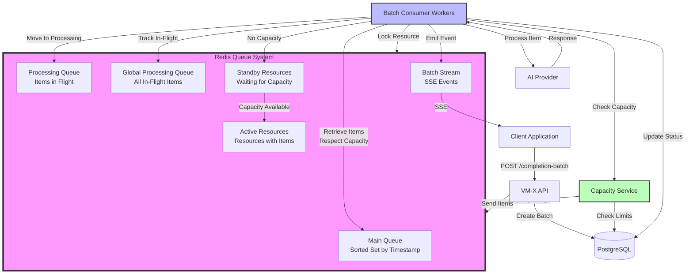
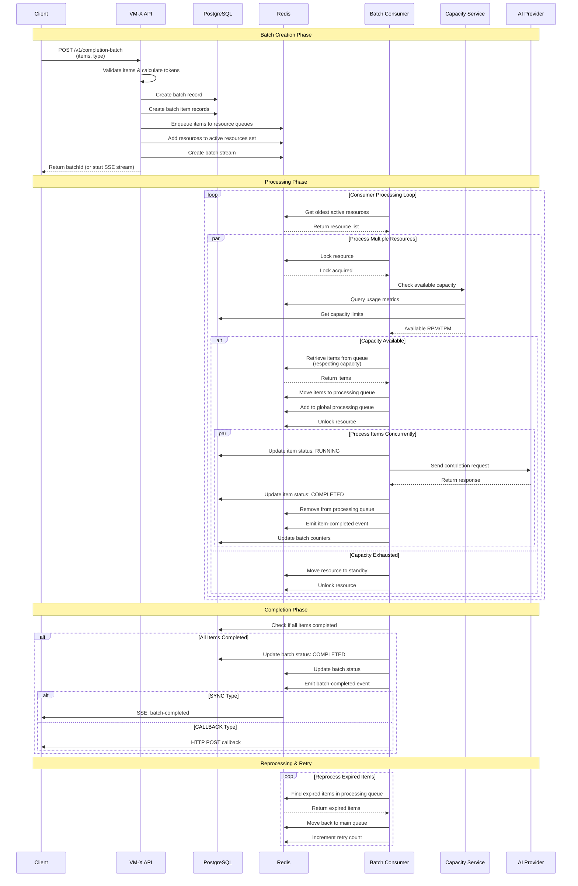

import Tabs from '@theme/Tabs';
import TabItem from '@theme/TabItem';

# Batch Completion

Batch Completion enables you to process large volumes of LLM requests (e.g., 1,000+ requests) while automatically respecting AI Connection and AI Resource capacity limits (TPM/RPM). Unlike traditional message queueing systems that process messages concurrently, Batch Completion intelligently schedules requests based on available capacity, ensuring you never exceed rate limits.

## Overview

Batch Completion is designed for scenarios where you need to process many LLM requests efficiently while staying within provider rate limits. The system uses Redis-based queuing with capacity-aware scheduling to ensure optimal throughput without violating TPM (Tokens Per Minute) or RPM (Requests Per Minute) constraints.

### Key Benefits

- **Capacity-Aware Processing**: Automatically respects AI Connection and AI Resource capacity limits (TPM/RPM)
- **Intelligent Scheduling**: Queues requests and processes them based on available capacity, not just concurrency
- **Multiple Response Methods**: Choose between Server-Sent Events (SSE), callback URLs, or async polling
- **Automatic Retry**: Built-in retry logic for transient failures
- **Batch-Level Capacity**: Override capacity limits per batch for custom rate limiting
- **Scalable**: Handles thousands of requests efficiently with Redis-based distributed queuing
- **Progress Tracking**: Real-time progress updates via SSE or callback events

### When to Use Batch Completion

Batch Completion is ideal for:

- **Batch Document Processing**: Processing large volumes of documents (summarization, extraction, analysis)
- **Data Pipeline Processing**: Bulk processing of data that requires LLM analysis
- **Content Generation at Scale**: Generating content for multiple items while respecting rate limits
- **Migration Tasks**: Migrating or transforming data using LLM operations
- **Scheduled Jobs**: Processing large batches on a schedule

## Architecture

The Batch Completion system uses Redis as a distributed queue with multiple data structures to manage capacity-aware processing:



### Queue System Components

1. **Main Queue** (`{workspaceId}:{environmentId}:{resourceId}:queue`): Sorted set containing pending items, ordered by creation timestamp
2. **Processing Queue** (`{workspaceId}:{environmentId}:{resourceId}:processing-queue`): Sorted set of items currently being processed with visibility timeout
3. **Global Processing Queue**: Tracks all in-flight items across all resources for monitoring and reprocessing
4. **Active Resources** (`global-active-resources-batch`): Sorted set of resources that have items ready to process
5. **Standby Resources** (`standby-resources-batch`): Sorted set of resources waiting for capacity to become available
6. **Batch Stream** (`{workspaceId}:{environmentId}:{batchId}:batch-queue-stream`): Redis Stream for SSE event delivery

## How It Works

### Batch Processing Flow

The following sequence diagram illustrates the complete flow of batch processing:



### 1. Batch Creation

When you create a batch, the system:

1. **Validates** all items and calculates estimated token counts
2. **Creates** batch and item records in PostgreSQL
3. **Groups** items by AI Resource
4. **Enqueues** items into Redis queues (one queue per resource)
5. **Adds** resources to the active resources set

### 2. Capacity-Aware Processing

The consumer workers continuously:

1. **Select** the oldest active resources (up to 10 at a time)
2. **Lock** each resource to prevent concurrent processing
3. **Check** available capacity (RPM/TPM) for the resource
4. **Retrieve** items from the queue, respecting:
   - Available requests (RPM limit)
   - Available tokens (TPM limit)
   - Estimated token count per item
5. **Move** items from main queue to processing queue
6. **Process** items concurrently (up to 1,000 concurrent tasks)

### 3. Capacity Management

The system checks capacity from multiple sources:

- **AI Connection Capacity**: Base capacity defined on the connection
- **AI Resource Capacity**: Resource-level capacity overrides
- **Batch-Level Capacity**: Optional per-batch capacity override
- **Discovered Capacity**: Automatically discovered provider limits (if available)

If capacity is exhausted:
- Items remain in the main queue
- Resource is moved to standby resources
- Resource is reactivated when capacity becomes available

### 4. Retry and Error Handling

- **Retryable Errors**: Items are moved back to the main queue with a delay
- **Non-Retryable Errors**: Items are marked as failed and removed
- **Visibility Timeout**: Items in processing queue expire after a timeout and are reprocessed if not completed
- **Reprocessing Loop**: Continuously monitors for expired items and reprocesses them

### 5. Progress Updates

Progress is tracked and delivered via:

- **SSE** (SYNC type): Real-time events as items complete
- **Callback URLs** (CALLBACK type): HTTP POST to your endpoint
- **Polling** (ASYNC type): Query batch status via API

## API Usage

### Batch Types

VM-X AI supports three batch types:

- **SYNC**: Stream results via Server-Sent Events (SSE)
- **ASYNC**: Process in background, poll for status
- **CALLBACK**: Process in background, receive HTTP callbacks

### Creating a Batch (SYNC)

<Tabs>
  <TabItem value="python" label="Python">

```python
import requests
import json

workspace_id = "6c41dc1b-910c-4358-beef-2c609d38db31"
environment_id = "6c1957ca-77ca-49b3-8fa1-0590281b8b44"

# Create batch with SYNC type
response = requests.post(
    f"http://localhost:3000/v1/completion-batch/{workspace_id}/{environment_id}",
    headers={
        "Authorization": "Bearer your-vmx-api-key",
        "Content-Type": "application/json",
    },
    json={
        "type": "SYNC",
        "items": [
            {
                "resourceId": "your-resource-id",
                "request": {
                    "messages": [
                        {"role": "user", "content": "Summarize this document: ..."}
                    ]
                }
            },
            {
                "resourceId": "your-resource-id",
                "request": {
                    "messages": [
                        {"role": "user", "content": "Extract key points from: ..."}
                    ]
                }
            }
        ]
    },
    stream=True  # Enable streaming for SSE
)

# Process SSE events
for line in response.iter_lines():
    if line:
        data = line.decode('utf-8')
        if data.startswith('data: '):
            event_data = json.loads(data[6:])
            if event_data.get('action') == 'item-completed':
                print(f"Item completed: {event_data['payload']['itemId']}")
            elif event_data.get('action') == 'batch-completed':
                print("Batch completed!")
                break
```

  </TabItem>
  <TabItem value="nodejs" label="Node.js">

```javascript
import axios from 'axios';

const workspaceId = "6c41dc1b-910c-4358-beef-2c609d38db31";
const environmentId = "6c1957ca-77ca-49b3-8fa1-0590281b8b44";

// Create batch with SYNC type
const response = await axios.post(
  `http://localhost:3000/v1/completion-batch/${workspaceId}/${environmentId}`,
  {
    type: 'SYNC',
    items: [
      {
        resourceId: 'your-resource-id',
        request: {
          messages: [
            { role: 'user', content: 'Summarize this document: ...' }
          ]
        }
      },
      {
        resourceId: 'your-resource-id',
        request: {
          messages: [
            { role: 'user', content: 'Extract key points from: ...' }
          ]
        }
      }
    ]
  },
  {
    headers: {
      Authorization: 'Bearer your-vmx-api-key',
      'Content-Type': 'application/json',
    },
    responseType: 'stream'
  }
);

// Process SSE events
response.data.on('data', (chunk) => {
  const lines = chunk.toString().split('\n');
  for (const line of lines) {
    if (line.startsWith('data: ')) {
      const event = JSON.parse(line.slice(6));
      if (event.action === 'item-completed') {
        console.log(`Item completed: ${event.payload.itemId}`);
      } else if (event.action === 'batch-completed') {
        console.log('Batch completed!');
      }
    }
  }
});
```

  </TabItem>
  <TabItem value="curl" label="cURL">

```bash
curl -N -X POST \
  "http://localhost:3000/v1/completion-batch/{workspaceId}/{environmentId}" \
  -H "Authorization: Bearer your-vmx-api-key" \
  -H "Content-Type: application/json" \
  -d '{
    "type": "SYNC",
    "items": [
      {
        "resourceId": "your-resource-id",
        "request": {
          "messages": [
            {"role": "user", "content": "Summarize this document: ..."}
          ]
        }
      }
    ]
  }'
```

  </TabItem>
</Tabs>

### Creating a Batch (ASYNC)

<Tabs>
  <TabItem value="python" label="Python">

```python
import requests
import time

workspace_id = "6c41dc1b-910c-4358-beef-2c609d38db31"
environment_id = "6c1957ca-77ca-49b3-8fa1-0590281b8b44"

# Create batch
response = requests.post(
    f"http://localhost:3000/v1/completion-batch/{workspace_id}/{environment_id}",
    headers={
        "Authorization": "Bearer your-vmx-api-key",
        "Content-Type": "application/json",
    },
    json={
        "type": "ASYNC",
        "items": [
            {
                "resourceId": "your-resource-id",
                "request": {
                    "messages": [
                        {"role": "user", "content": "Process document..."}
                    ]
                }
            }
        ]
    }
)

batch = response.json()
batch_id = batch["batchId"]

# Poll for status
while True:
    status_response = requests.get(
        f"http://localhost:3000/v1/completion-batch/{workspace_id}/{environment_id}/{batch_id}",
        headers={"Authorization": "Bearer your-vmx-api-key"}
    )
    batch_status = status_response.json()
    
    print(f"Progress: {batch_status['completedPercentage']}%")
    
    if batch_status["status"] in ["COMPLETED", "FAILED"]:
        break
    
    time.sleep(5)  # Poll every 5 seconds
```

  </TabItem>
  <TabItem value="nodejs" label="Node.js">

```javascript
import axios from 'axios';

const workspaceId = "6c41dc1b-910c-4358-beef-2c609d38db31";
const environmentId = "6c1957ca-77ca-49b3-8fa1-0590281b8b44";

// Create batch
const { data: batch } = await axios.post(
  `http://localhost:3000/v1/completion-batch/${workspaceId}/${environmentId}`,
  {
    type: 'ASYNC',
    items: [
      {
        resourceId: 'your-resource-id',
        request: {
          messages: [
            { role: 'user', content: 'Process document...' }
          ]
        }
      }
    ]
  },
  {
    headers: {
      Authorization: 'Bearer your-vmx-api-key',
      'Content-Type': 'application/json',
    }
  }
);

const batchId = batch.batchId;

// Poll for status
const pollStatus = async () => {
  while (true) {
    const { data: batchStatus } = await axios.get(
      `http://localhost:3000/v1/completion-batch/${workspaceId}/${environmentId}/${batchId}`,
      {
        headers: {
          Authorization: 'Bearer your-vmx-api-key',
        }
      }
    );
    
    console.log(`Progress: ${batchStatus.completedPercentage}%`);
    
    if (['COMPLETED', 'FAILED'].includes(batchStatus.status)) {
      break;
    }
    
    await new Promise(resolve => setTimeout(resolve, 5000)); // Poll every 5 seconds
  }
};

pollStatus();
```

  </TabItem>
</Tabs>

### Creating a Batch (CALLBACK)

<Tabs>
  <TabItem value="python" label="Python">

```python
import requests

workspace_id = "6c41dc1b-910c-4358-beef-2c609d38db31"
environment_id = "6c1957ca-77ca-49b3-8fa1-0590281b8b44"

# Create batch with callback
response = requests.post(
    f"http://localhost:3000/v1/completion-batch/{workspace_id}/{environment_id}",
    headers={
        "Authorization": "Bearer your-vmx-api-key",
        "Content-Type": "application/json",
    },
    json={
        "type": "CALLBACK",
        "callbackOptions": {
            "url": "https://your-app.com/batch-callback",
            "headers": {
                "X-API-Key": "your-secret-key"
            },
            "events": ["ITEM_UPDATE", "BATCH_UPDATE"]
        },
        "items": [
            {
                "resourceId": "your-resource-id",
                "request": {
                    "messages": [
                        {"role": "user", "content": "Process document..."}
                    ]
                }
            }
        ]
    }
)

batch = response.json()
print(f"Batch created: {batch['batchId']}")
```

  </TabItem>
  <TabItem value="nodejs" label="Node.js">

```javascript
import axios from 'axios';

const workspaceId = "6c41dc1b-910c-4358-beef-2c609d38db31";
const environmentId = "6c1957ca-77ca-49b3-8fa1-0590281b8b44";

// Create batch with callback
const { data: batch } = await axios.post(
  `http://localhost:3000/v1/completion-batch/${workspaceId}/${environmentId}`,
  {
    type: 'CALLBACK',
    callbackOptions: {
      url: 'https://your-app.com/batch-callback',
      headers: {
        'X-API-Key': 'your-secret-key'
      },
      events: ['ITEM_UPDATE', 'BATCH_UPDATE']
    },
    items: [
      {
        resourceId: 'your-resource-id',
        request: {
          messages: [
            { role: 'user', content: 'Process document...' }
          ]
        }
      }
    ]
  },
  {
    headers: {
      Authorization: 'Bearer your-vmx-api-key',
      'Content-Type': 'application/json',
    }
  }
);

console.log(`Batch created: ${batch.batchId}`);
```

  </TabItem>
</Tabs>

### Batch-Level Capacity

Override capacity limits for a specific batch:

```json
{
  "type": "ASYNC",
  "capacity": [
    {
      "period": "MINUTE",
      "requests": 50,
      "tokens": 50000,
      "enabled": true
    }
  ],
  "items": [...]
}
```

This allows you to:
- Process batches at a slower rate to avoid overwhelming downstream systems
- Allocate specific capacity to a batch for cost control
- Test different rate limits without modifying AI Resource configuration

## SSE Event Types

When using SYNC type, you receive events via Server-Sent Events:

- **`batch-created`**: Batch was created and queued
- **`item-running`**: Item started processing
- **`item-completed`**: Item completed successfully
- **`item-failed`**: Item failed with error
- **`batch-completed`**: All items completed
- **`batch-failed`**: Batch failed (some items failed)

## Callback Events

When using CALLBACK type, your endpoint receives HTTP POST requests:

- **`ITEM_UPDATE`**: Sent when an item completes or fails
- **`BATCH_UPDATE`**: Sent when the batch completes or fails
- **`ALL`**: Receive all events

## Best Practices

### 1. Estimate Batch Size

- Calculate estimated tokens per item
- Ensure total tokens don't exceed your capacity
- Consider processing time based on your TPM/RPM limits

### 2. Choose the Right Type

- **SYNC**: Use for interactive applications or when you need immediate feedback
- **ASYNC**: Use for background processing with polling
- **CALLBACK**: Use for webhook-based integrations

### 3. Handle Errors

- Implement retry logic for transient failures
- Monitor batch status regularly
- Set up alerts for failed batches

### 4. Monitor Capacity

- Monitor your capacity usage
- Adjust batch-level capacity if needed
- Consider processing during off-peak hours for large batches

### 5. Optimize Item Size

- Keep items reasonably sized
- Avoid extremely large prompts that consume too many tokens
- Consider splitting very large documents into smaller chunks

## Troubleshooting

### Batch Stuck in PENDING

1. **Check Capacity**: Verify you have available capacity (RPM/TPM)
2. **Check Workers**: Ensure batch consumer workers are running
3. **Check Redis**: Verify Redis connectivity and queue status
4. **Review Logs**: Check application logs for errors

### Items Failing

1. **Check Error Messages**: Review item error messages in batch status
2. **Verify Resource**: Ensure AI Resource is configured correctly
3. **Check API Keys**: Verify API keys have access to the resource
4. **Review Provider Errors**: Check underlying provider error messages

### Slow Processing

1. **Check Capacity Limits**: Low TPM/RPM limits will slow processing
2. **Monitor Queue Depth**: Large queues may take time to process
3. **Check Worker Count**: More workers can process items faster
4. **Review Item Complexity**: Complex prompts take longer to process

## Next Steps

- [AI Resources](./ai-resources/index.md) - Learn about AI Resources
- [AI Connections](./ai-connections.md) - Configure AI Connections
- [Capacity Management](./ai-resources/capacity.md) - Understand capacity limits
- [Usage Monitoring](./usage.md) - Monitor batch usage and metrics

