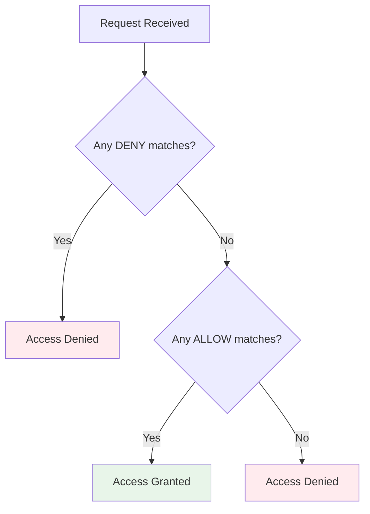

# Role Policy Guide

VM-X AI uses a policy-based access control system for fine-grained permissions. This guide provides a comprehensive explanation of how to create and manage role policies.

## Policy Structure

A role policy consists of one or more **statements**. Each statement defines what actions are allowed or denied on which resources.

### Basic Policy Format

```json
{
  "statements": [
    {
      "effect": "ALLOW",
      "actions": ["action:operation"],
      "resources": ["resource:pattern"]
    }
  ]
}
```

### Policy Components

#### Effect

The `effect` field determines whether the statement allows or denies access:

- **`ALLOW`**: Permits the specified actions on the specified resources
- **`DENY`**: Explicitly blocks the specified actions on the specified resources

:::important
DENY statements are evaluated first and take precedence over ALLOW statements. If a DENY statement matches, access is denied regardless of any ALLOW statements.
:::

#### Actions

Actions follow the pattern: `{module}:{operation}`

**Available Operations:**

- `create` - Create a new resource
- `get` - Retrieve a specific resource
- `list` - List all resources
- `update` - Update an existing resource
- `delete` - Delete a resource

**Examples:**

- `workspace:create` - Create a workspace
- `ai-connection:get` - Get an AI connection
- `user:list` - List all users
- `role:update` - Update a role

**Wildcards:**

- `*` - Matches all operations
- `*:get` - Matches all "get" operations across all modules
- `workspace:*` - Matches all operations for workspace module

#### Resources

Resources follow a hierarchical pattern: `{module}:{identifier}:{submodule}:{identifier}:...`

**Examples:**

- `workspace:*` - All workspaces
- `workspace:production` - Specific workspace named "production"
- `workspace:*:environment:*` - All environments in all workspaces
- `workspace:production:environment:staging` - Specific environment
- `workspace:*:environment:*:ai-connection:*` - All AI connections
- `workspace:production:environment:staging:ai-connection:openai` - Specific AI connection

**Wildcards:**

- `*` - Matches all resources
- `workspace:*` - Matches all workspaces
- `workspace:*:environment:*` - Matches all environments in all workspaces

## Available Modules

VM-X AI provides the following modules for policy configuration:

### Workspace Module

**Base Resource**: `workspace:${workspace.name}`  
**Item Resource**: `workspace:${workspace.name}`

**Actions:**

- `workspace:create`
- `workspace:get`
- `workspace:list`
- `workspace:update`
- `workspace:delete`

**Example:**

```json
{
  "effect": "ALLOW",
  "actions": ["workspace:get", "workspace:list"],
  "resources": ["workspace:*"]
}
```

### Environment Module

**Base Resource**: `workspace:${workspace.name}:environment:${environment.name}`  
**Item Resource**: `workspace:${workspace.name}:environment:${environment.name}`

**Actions:**

- `environment:create`
- `environment:get`
- `environment:list`
- `environment:update`
- `environment:delete`

**Example:**

```json
{
  "effect": "ALLOW",
  "actions": ["environment:*"],
  "resources": ["workspace:production:environment:*"]
}
```

### AI Connection Module

**Base Resource**: `workspace:${workspace.name}:environment:${environment.name}:ai-connection:${aiConnection.name}`  
**Item Resource**: `workspace:${workspace.name}:environment:${environment.name}:ai-connection:${aiConnection.name}`

**Actions:**

- `ai-connection:create`
- `ai-connection:get`
- `ai-connection:list`
- `ai-connection:update`
- `ai-connection:delete`

**Example:**

```json
{
  "effect": "ALLOW",
  "actions": ["ai-connection:create", "ai-connection:get", "ai-connection:list"],
  "resources": ["workspace:*:environment:*:ai-connection:*"]
}
```

### AI Resource Module

**Base Resource**: `workspace:${workspace.name}:environment:${environment.name}:ai-resource:${aiResource.name}`  
**Item Resource**: `workspace:${workspace.name}:environment:${environment.name}:ai-resource:${aiResource.name}`

**Actions:**

- `ai-resource:create`
- `ai-resource:get`
- `ai-resource:list`
- `ai-resource:update`
- `ai-resource:delete`

**Example:**

```json
{
  "effect": "ALLOW",
  "actions": ["ai-resource:*"],
  "resources": ["workspace:*:environment:*:ai-resource:*"]
}
```

### API Key Module

**Base Resource**: `workspace:${workspace.name}:environment:${environment.name}:api-key:${apiKey.name}`  
**Item Resource**: `workspace:${workspace.name}:environment:${environment.name}:api-key:${apiKey.name}`

**Actions:**

- `api-key:create`
- `api-key:get`
- `api-key:list`
- `api-key:update`
- `api-key:delete`

### Completion Module

**Base Resource**: `workspace:${workspace.name}:environment:${environment.name}:completion`  
**Item Resource**: `workspace:${workspace.name}:environment:${environment.name}:completion`

**Actions:**

- `completion:create`

**Example:**

```json
{
  "effect": "ALLOW",
  "actions": ["completion:create"],
  "resources": ["workspace:*:environment:*:completion"]
}
```

### Completion Audit Module

**Base Resource**: `workspace:${workspace.name}:environment:${environment.name}:completion-audit`  
**Item Resource**: `workspace:${workspace.name}:environment:${environment.name}:completion-audit`

**Actions:**

- `completion-audit:get`
- `completion-audit:list`

### Completion Metrics Module

**Base Resource**: `workspace:${workspace.name}:environment:${environment.name}:completion-metrics`  
**Item Resource**: `workspace:${workspace.name}:environment:${environment.name}:completion-metrics`

**Actions:**

- `completion-metrics:get`
- `completion-metrics:list`

### Completion Usage Module

**Base Resource**: `workspace:${workspace.name}:environment:${environment.name}:completion-usage`  
**Item Resource**: `workspace:${workspace.name}:environment:${environment.name}:completion-usage`

**Actions:**

- `completion-usage:get`
- `completion-usage:list`

### Pool Definition Module

**Base Resource**: `workspace:${workspace.name}:environment:${environment.name}:pool-definition`  
**Item Resource**: `workspace:${workspace.name}:environment:${environment.name}:pool-definition`

**Actions:**

- `pool-definition:get`
- `pool-definition:update`

### User Module

**Base Resource**: `user:${user.email}`  
**Item Resource**: `user:${user.email}`

**Actions:**

- `user:create`
- `user:get`
- `user:list`
- `user:update`
- `user:delete`

### Role Module

**Base Resource**: `role:${role.name}`  
**Item Resource**: `role:${role.name}`

**Actions:**

- `role:create`
- `role:get`
- `role:list`
- `role:update`
- `role:delete`

## Policy Examples

### Example 1: Read-Only Role

Allow read-only access to all resources:

```json
{
  "statements": [
    {
      "effect": "ALLOW",
      "actions": ["*:get", "*:list"],
      "resources": ["*"]
    }
  ]
}
```

### Example 2: Developer Role

Allow developers to create and manage resources, but not delete workspaces or manage users:

```json
{
  "statements": [
    {
      "effect": "DENY",
      "actions": ["workspace:delete", "user:*", "role:*"],
      "resources": ["*"]
    },
    {
      "effect": "ALLOW",
      "actions": ["*"],
      "resources": ["*"]
    }
  ]
}
```

### Example 3: Environment-Specific Access

Allow full access to production environment only:

```json
{
  "statements": [
    {
      "effect": "ALLOW",
      "actions": ["*"],
      "resources": ["workspace:*:environment:production:*", "workspace:*:environment:production"]
    }
  ]
}
```

### Example 4: Restricted AI Connection Access

Allow viewing and creating AI connections, but not updating or deleting:

```json
{
  "statements": [
    {
      "effect": "ALLOW",
      "actions": ["ai-connection:create", "ai-connection:get", "ai-connection:list"],
      "resources": ["workspace:*:environment:*:ai-connection:*"]
    },
    {
      "effect": "DENY",
      "actions": ["ai-connection:update", "ai-connection:delete"],
      "resources": ["workspace:*:environment:*:ai-connection:*"]
    }
  ]
}
```

### Example 5: Workspace Owner

Allow all actions except user and role management:

```json
{
  "statements": [
    {
      "effect": "DENY",
      "actions": ["user:*", "role:*"],
      "resources": ["*"]
    },
    {
      "effect": "ALLOW",
      "actions": ["*"],
      "resources": ["*"]
    }
  ]
}
```

## Policy Evaluation

Policies are evaluated in the following order:

1. **DENY Statements**: If any DENY statement matches, access is denied
2. **ALLOW Statements**: If an ALLOW statement matches, access is granted
3. **Default**: If no statements match, access is denied

### Evaluation Logic



### Matching Rules

1. **Action Matching**: The requested action must match one of the statement's actions (supports wildcards)
2. **Resource Matching**: The requested resource must match one of the statement's resources (supports wildcards)
3. **Effect Application**: If both action and resource match, the effect (ALLOW/DENY) is applied

## Best Practices

### 1. Principle of Least Privilege

Grant only the minimum permissions needed:

```json
{
  "statements": [
    {
      "effect": "ALLOW",
      "actions": ["ai-connection:get", "ai-connection:list"],
      "resources": ["workspace:production:environment:*:ai-connection:*"]
    }
  ]
}
```

### 2. Use DENY for Explicit Restrictions

Use DENY statements to explicitly block actions:

```json
{
  "statements": [
    {
      "effect": "DENY",
      "actions": ["workspace:delete"],
      "resources": ["*"]
    },
    {
      "effect": "ALLOW",
      "actions": ["*"],
      "resources": ["*"]
    }
  ]
}
```

### 3. Organize by Function

Create roles for specific job functions:

- **Viewer**: Read-only access
- **Developer**: Create and update resources
- **Operator**: Manage resources but not users/roles
- **Admin**: Full access

### 4. Test Policies

Test policies before assigning to users:

1. Create a test role with the policy
2. Assign to a test user
3. Verify permissions work as expected
4. Remove test role and user

### 5. Document Policies

Document the purpose and scope of each policy:

```json
{
  "name": "developer",
  "description": "Developer role with limited permissions",
  "policy": {
    "statements": [
      // ... statements
    ]
  }
}
```

## Common Patterns

### Pattern 1: Environment Isolation

Restrict access to specific environments:

```json
{
  "statements": [
    {
      "effect": "ALLOW",
      "actions": ["*"],
      "resources": ["workspace:*:environment:production:*", "workspace:*:environment:staging:*"]
    }
  ]
}
```

### Pattern 2: Module-Specific Access

Allow access to specific modules only:

```json
{
  "statements": [
    {
      "effect": "ALLOW",
      "actions": ["ai-connection:*", "ai-resource:*"],
      "resources": ["workspace:*:environment:*:ai-connection:*", "workspace:*:environment:*:ai-resource:*"]
    }
  ]
}
```

### Pattern 3: Read-Only with Exceptions

Read-only access with ability to create:

```json
{
  "statements": [
    {
      "effect": "ALLOW",
      "actions": ["*:get", "*:list", "*:create"],
      "resources": ["*"]
    },
    {
      "effect": "DENY",
      "actions": ["*:update", "*:delete"],
      "resources": ["*"]
    }
  ]
}
```

## Troubleshooting

### Access Denied Errors

If you get access denied errors:

1. **Check Role Assignment**: Verify the user has a role assigned
2. **Check Policy Statements**: Review the role's policy statements
3. **Check Action Match**: Verify the action matches a statement action
4. **Check Resource Match**: Verify the resource matches a statement resource
5. **Check DENY Statements**: Look for DENY statements that might be blocking access

### Policy Not Working

If a policy is not working as expected:

1. **Check Statement Order**: DENY statements are evaluated first
2. **Check Wildcards**: Verify wildcards are used correctly
3. **Check Resource Patterns**: Ensure resource patterns match the actual resources
4. **Test Incrementally**: Start with simple policies and add complexity

### Common Mistakes

1. **Too Permissive**: Using `*` for actions and resources grants too much access
2. **Missing DENY**: Not using DENY statements for explicit restrictions
3. **Incorrect Patterns**: Resource patterns don't match actual resource structure
4. **Statement Order**: DENY statements must come before ALLOW statements when both are needed

## UI Policy Editor

The VM-X AI UI provides a visual policy editor with:

- **Permission Table**: Shows all available modules, actions, and resource patterns
- **JSON Editor**: Direct JSON editing with schema validation
- **Examples**: Pre-built policy examples
- **Validation**: Real-time policy validation

Access the policy editor when creating or editing roles in the UI.

## Next Steps

- [Roles](./roles.md) - Learn about role management
- [Users](./users.md) - Learn about user management
- [Workspaces and Environments](../features/workspaces-environments.md) - Understand workspace isolation
- [AI Connections](../features/ai-connections.md) - Create AI provider connections
