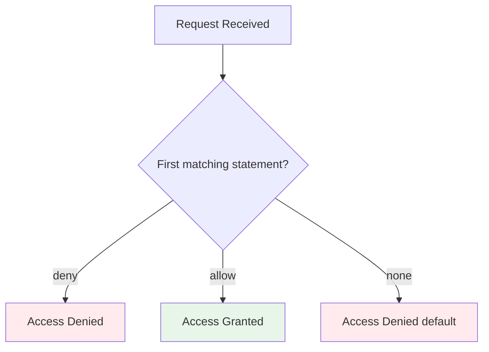

# Role Policy Guide

VM-X AI uses a policy-based access control system for fine-grained
permissions. This guide is a comprehensive reference for the policy schema,
the available modules and actions, and the rules used by the API to evaluate
a request.

## Policy Structure

A role policy is a JSON document with a `$schema` URL and one or more
**statements**. Each statement decides whether a given action is allowed or
denied on a given resource.

### Basic Policy Format

```json
{
  "$schema": "https://vm-x.ai/schema/role-policy.json",
  "statements": [
    {
      "effect": "allow",
      "actions": ["module:operation"],
      "resources": ["resource:pattern"]
    }
  ]
}
```

### Policy Components

#### Effect

The `effect` field must be one of:

- **`"allow"`** — Permits the specified actions on the specified resources
- **`"deny"`** — Explicitly blocks the specified actions on the specified resources

:::important
`effect` values are lowercase strings. The API rejects `"ALLOW"`/`"DENY"`.
A matching `deny` statement always wins over an `allow` statement, regardless
of their order in the document.
:::

#### Actions

Actions follow the pattern `{module}:{operation}`. The set of operations
varies by module — there is no fixed CRUD vocabulary. Some modules have
custom operations such as `completion:execute`, `completion-batch:cancel`,
`workspace:get-members`, `role:assign`, or
`completion-metrics:get-error-rate`. The full canonical list is at
[Available Modules](#available-modules) below.

**Wildcards** (apply to action and resource strings alike):

- `*` matches any sequence of characters (including the empty string)
- `?` matches a single character

**Examples:**

- `*` matches every action
- `*:get` matches every `get` operation across all modules
- `workspace:*` matches every workspace action
- `*:list` matches every `list` operation

#### Resources

Resources follow a hierarchical pattern that nests parent → child:
`{module}:{identifier}:{submodule}:{identifier}:...`. The identifiers are
substituted at request time by the API: workspace and environment use their
`name`, AI Connection uses `connection.name`, AI Resource uses
`resource.name`, API Key uses `apiKey.name`, Completion Batch uses
`batch.id`, User uses `user.email`, and Role uses `role.name`.

**Examples:**

- `workspace:*` — all workspaces
- `workspace:production` — workspace named `production`
- `workspace:*:environment:*` — every environment in every workspace
- `workspace:production:environment:staging` — specific environment
- `workspace:*:environment:*:ai-connection:*` — every AI connection everywhere
- `workspace:production:environment:staging:ai-connection:openai` — specific AI connection

## Available Modules

The API exposes the canonical module list at `GET /role/permissions`. The
table below mirrors that endpoint.

### Workspace Module

**Base Resource**: `workspace`
**Item Resource**: `workspace:${workspace.name}`

**Actions:**

- `workspace:list`
- `workspace:get`
- `workspace:get-members`
- `workspace:create`
- `workspace:update`
- `workspace:update-member-role`
- `workspace:delete`
- `workspace:assign`
- `workspace:unassign`

**Example:**

```json
{
  "effect": "allow",
  "actions": ["workspace:get", "workspace:list"],
  "resources": ["workspace:*"]
}
```

### Environment Module

**Base Resource**: `workspace:${workspace.name}:environment`
**Item Resource**: `workspace:${workspace.name}:environment:${environment.name}`

**Actions:**

- `environment:list`
- `environment:get`
- `environment:create`
- `environment:update`
- `environment:delete`

**Example:**

```json
{
  "effect": "allow",
  "actions": ["environment:list", "environment:get", "environment:create", "environment:update", "environment:delete"],
  "resources": ["workspace:production:environment:*"]
}
```

### AI Connection Module

**Base Resource**: `workspace:${workspace.name}:environment:${environment.name}:ai-connection`
**Item Resource**: `workspace:${workspace.name}:environment:${environment.name}:ai-connection:${connection.name}`

**Actions:**

- `ai-connection:list`
- `ai-connection:get`
- `ai-connection:create`
- `ai-connection:update`
- `ai-connection:delete`

**Example:**

```json
{
  "effect": "allow",
  "actions": ["ai-connection:create", "ai-connection:get", "ai-connection:list"],
  "resources": ["workspace:*:environment:*:ai-connection:*"]
}
```

### AI Resource Module

**Base Resource**: `workspace:${workspace.name}:environment:${environment.name}:ai-resource`
**Item Resource**: `workspace:${workspace.name}:environment:${environment.name}:ai-resource:${resource.name}`

**Actions:**

- `ai-resource:list`
- `ai-resource:get`
- `ai-resource:create`
- `ai-resource:update`
- `ai-resource:delete`

**Example:**

```json
{
  "effect": "allow",
  "actions": ["ai-resource:list", "ai-resource:get", "ai-resource:create", "ai-resource:update", "ai-resource:delete"],
  "resources": ["workspace:*:environment:*:ai-resource:*"]
}
```

### API Key Module

**Base Resource**: `workspace:${workspace.name}:environment:${environment.name}:api-key`
**Item Resource**: `workspace:${workspace.name}:environment:${environment.name}:api-key:${apiKey.name}`

**Actions:**

- `api-key:list`
- `api-key:get`
- `api-key:create`
- `api-key:update`
- `api-key:delete`

API keys themselves do not use role policies to authorise traffic — they
authorise via a per-key allow-list of AI Resource UUIDs and SHA-256 hash
verification. The actions above only govern who can manage the API key
records (list, create, rotate, etc.).

### Pool Definition Module

**Base Resource**: `workspace:${workspace.name}:environment:${environment.name}:pool-definition`
**Item Resource**: `workspace:${workspace.name}:environment:${environment.name}:pool-definition`

**Actions:**

- `pool-definition:get`
- `pool-definition:update`
- `pool-definition:delete`

### Completion Module

**Base Resource**: `workspace:${workspace.name}:environment:${environment.name}:completion`
**Item Resource**: `workspace:${workspace.name}:environment:${environment.name}:completion:${completion.id}`

**Actions:**

- `completion:execute`

**Example:**

```json
{
  "effect": "allow",
  "actions": ["completion:execute"],
  "resources": ["workspace:*:environment:*:completion"]
}
```

### Completion Batch Module

**Base Resource**: `workspace:${workspace.name}:environment:${environment.name}:completion-batch`
**Item Resource**: `workspace:${workspace.name}:environment:${environment.name}:completion-batch:${batch.id}`

**Actions:**

- `completion-batch:list`
- `completion-batch:get`
- `completion-batch:create`
- `completion-batch:cancel`

### Completion Metrics Module

**Base Resource**: `workspace:${workspace.name}:environment:${environment.name}:completion-metrics`
**Item Resource**: `workspace:${workspace.name}:environment:${environment.name}:completion-metrics`

**Actions:**

- `completion-metrics:get-error-rate`

### Request Audit Module

**Base Resource**: `workspace:${workspace.name}:environment:${environment.name}:request-audit`
**Item Resource**: `workspace:${workspace.name}:environment:${environment.name}:request-audit:${requestAudit.id}`

**Actions:**

- `request-audit:list`

### Request Usage Module

**Base Resource**: `workspace:${workspace.name}:environment:${environment.name}:request-usage`
**Item Resource**: `workspace:${workspace.name}:environment:${environment.name}:request-usage:${requestUsage.id}`

**Actions:**

- `request-usage:query`

### User Module

**Base Resource**: `user`
**Item Resource**: `user:${user.email}`

**Actions:**

- `user:list`
- `user:get`
- `user:create`
- `user:update`
- `user:delete`

### Role Module

**Base Resource**: `role`
**Item Resource**: `role:${role.name}`

**Actions:**

- `role:list`
- `role:get`
- `role:get-members`
- `role:create`
- `role:update`
- `role:delete`
- `role:assign`
- `role:unassign`

## Policy Examples

### Example 1: Read-Only Role

Allow read-only access to all resources:

```json
{
  "$schema": "https://vm-x.ai/schema/role-policy.json",
  "statements": [
    {
      "effect": "allow",
      "actions": ["*:get", "*:list"],
      "resources": ["*"]
    }
  ]
}
```

### Example 2: Developer Role

Allow developers to create and manage resources, but not delete workspaces
or manage users/roles:

```json
{
  "$schema": "https://vm-x.ai/schema/role-policy.json",
  "statements": [
    {
      "effect": "deny",
      "actions": ["workspace:delete", "user:create", "user:update", "user:delete", "role:create", "role:update", "role:delete"],
      "resources": ["*"]
    },
    {
      "effect": "allow",
      "actions": ["*"],
      "resources": ["*"]
    }
  ]
}
```

### Example 3: Environment-Specific Access

Allow full access to the production environment only:

```json
{
  "$schema": "https://vm-x.ai/schema/role-policy.json",
  "statements": [
    {
      "effect": "allow",
      "actions": ["*"],
      "resources": ["workspace:*:environment:production", "workspace:*:environment:production:*"]
    }
  ]
}
```

### Example 4: Restricted AI Connection Access

Allow viewing and creating AI connections, but not updating or deleting:

```json
{
  "$schema": "https://vm-x.ai/schema/role-policy.json",
  "statements": [
    {
      "effect": "allow",
      "actions": ["ai-connection:create", "ai-connection:get", "ai-connection:list"],
      "resources": ["workspace:*:environment:*:ai-connection:*"]
    },
    {
      "effect": "deny",
      "actions": ["ai-connection:update", "ai-connection:delete"],
      "resources": ["workspace:*:environment:*:ai-connection:*"]
    }
  ]
}
```

### Example 5: Workspace Owner

Allow all actions except user and role management:

```json
{
  "$schema": "https://vm-x.ai/schema/role-policy.json",
  "statements": [
    {
      "effect": "deny",
      "actions": ["user:create", "user:update", "user:delete", "role:create", "role:update", "role:delete"],
      "resources": ["*"]
    },
    {
      "effect": "allow",
      "actions": ["*"],
      "resources": ["*"]
    }
  ]
}
```

## Policy Evaluation

Every protected request resolves to an `(action, resource)` pair. The API
walks the user's roles statement-by-statement and returns the first match it
finds. The full algorithm:

1. For each role assigned to the user:
   1. For each statement in the role's policy:
      1. If any of the statement's `actions` (regex-matched with `*`/`?`)
         matches the request's action **and** any of the statement's
         `resources` matches the request's resource:
         - If `effect` is `"deny"` → return **403 Forbidden** immediately.
         - If `effect` is `"allow"` → return **allowed** immediately.
2. If no statement matched in any role → return **403 Forbidden**.

Because the loop short-circuits on the first match (deny or allow) inside a
single role, ordering inside a role's `statements` array matters: put your
`deny` rules first if you want them to override `allow` rules in the same
role. (The default seeded `power-user` role does exactly this.)

### Evaluation Logic


```mermaid
flowchart TD
    A[Request Received] --> B{First matching statement?}
    B -->|deny| C[Access Denied]
    B -->|allow| E[Access Granted]
    B -->|none| F[Access Denied default]

    style C fill:#ffebee
    style E fill:#e8f5e9
    style F fill:#ffebee
```

### Matching Rules

1. **Action matching**: the requested action must regex-match one of the
   statement's `actions` strings (after `*` → `.*` and `?` → `.` substitution).
2. **Resource matching**: the requested resource must regex-match one of the
   statement's `resources` strings, using the same wildcard rules.
3. **Effect application**: when both action and resource match, the
   statement's `effect` is applied immediately.

## Best Practices

### 1. Principle of Least Privilege

Grant only the minimum permissions needed:

```json
{
  "$schema": "https://vm-x.ai/schema/role-policy.json",
  "statements": [
    {
      "effect": "allow",
      "actions": ["ai-connection:get", "ai-connection:list"],
      "resources": ["workspace:production:environment:*:ai-connection:*"]
    }
  ]
}
```

### 2. Use `deny` for Explicit Restrictions

Use `deny` to fence off dangerous actions even when `allow` is broad:

```json
{
  "$schema": "https://vm-x.ai/schema/role-policy.json",
  "statements": [
    {
      "effect": "deny",
      "actions": ["workspace:delete"],
      "resources": ["*"]
    },
    {
      "effect": "allow",
      "actions": ["*"],
      "resources": ["*"]
    }
  ]
}
```

### 3. Organize by Function

Create roles for specific job functions:

- **Viewer**: Read-only access
- **Developer**: Create and update resources
- **Operator**: Manage resources but not users/roles
- **Admin**: Full access

### 4. Test Policies

Test policies before assigning to users:

1. Create a test role with the policy
2. Assign to a test user
3. Verify permissions work as expected
4. Remove test role and user

### 5. Document Policies

Document the purpose and scope of each policy:

```json
{
  "name": "developer",
  "description": "Developer role with limited permissions",
  "policy": {
    "$schema": "https://vm-x.ai/schema/role-policy.json",
    "statements": [
      // ... statements
    ]
  }
}
```

## Common Patterns

### Pattern 1: Environment Isolation

Restrict access to specific environments:

```json
{
  "$schema": "https://vm-x.ai/schema/role-policy.json",
  "statements": [
    {
      "effect": "allow",
      "actions": ["*"],
      "resources": ["workspace:*:environment:production", "workspace:*:environment:production:*", "workspace:*:environment:staging", "workspace:*:environment:staging:*"]
    }
  ]
}
```

### Pattern 2: Module-Specific Access

Allow access to specific modules only:

```json
{
  "$schema": "https://vm-x.ai/schema/role-policy.json",
  "statements": [
    {
      "effect": "allow",
      "actions": ["ai-connection:*", "ai-resource:*"],
      "resources": ["workspace:*:environment:*:ai-connection:*", "workspace:*:environment:*:ai-resource:*"]
    }
  ]
}
```

### Pattern 3: Read-Only with Exceptions

Read-only access with the ability to create:

```json
{
  "$schema": "https://vm-x.ai/schema/role-policy.json",
  "statements": [
    {
      "effect": "deny",
      "actions": ["*:update", "*:delete"],
      "resources": ["*"]
    },
    {
      "effect": "allow",
      "actions": ["*:get", "*:list", "*:create"],
      "resources": ["*"]
    }
  ]
}
```

## Troubleshooting

### Access Denied Errors

If you get access denied errors:

1. **Check Role Assignment**: Verify the user has at least one role assigned
2. **Check Policy Statements**: Review the role's policy statements
3. **Check Action Match**: Verify the request's action regex-matches a statement action
4. **Check Resource Match**: Verify the request's resource regex-matches a statement resource — including every level of the hierarchy
5. **Check `deny` Statements**: Look for `deny` statements that might be matching first

### Policy Not Working

If a policy is not working as expected:

1. **Check Statement Order**: The first matching statement wins. Put `deny` rules first if you want them to override `allow` rules in the same role.
2. **Check Wildcards**: `*` only expands to `.*`; it doesn't grant permission across siblings if the rest of the path doesn't match.
3. **Check Resource Patterns**: Ensure resource patterns match every level of the actual resource ARN (workspace + environment + module + item).
4. **Test Incrementally**: Start with simple policies and add complexity.

### Common Mistakes

1. **Wrong case for `effect`**: must be `"allow"` / `"deny"` lowercase.
2. **Too permissive**: using `*` for actions and resources grants too much access.
3. **Missing `deny`**: not using `deny` statements for explicit restrictions.
4. **Incorrect patterns**: resource patterns don't match the actual ARN structure.
5. **Statement order inside a role**: `deny` must come before `allow` if both match the same request.

## UI Policy Editor

The VM-X AI UI provides a visual policy editor backed by the
`GET /role/permissions` endpoint:

- **Permission Table**: Lists every module, action, base resource, and item resource
- **JSON Editor**: Direct JSON editing
- **Examples**: Pre-built policy snippets
- **Validation**: Real-time validation against the schema

Access the policy editor when creating or editing roles in the UI.

## Next Steps

- [Roles](./roles.md) - Learn about role management
- [Users](./users.md) - Learn about user management
- [Workspaces and Environments](../features/workspaces-environments.md) - Understand workspace isolation
- [AI Connections](../features/ai-connections.md) - Create AI provider connections
